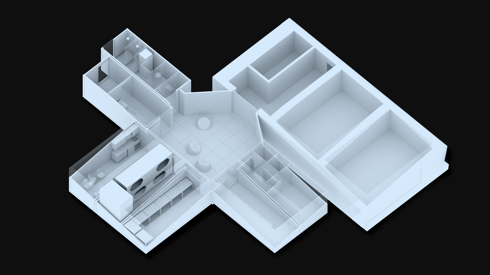
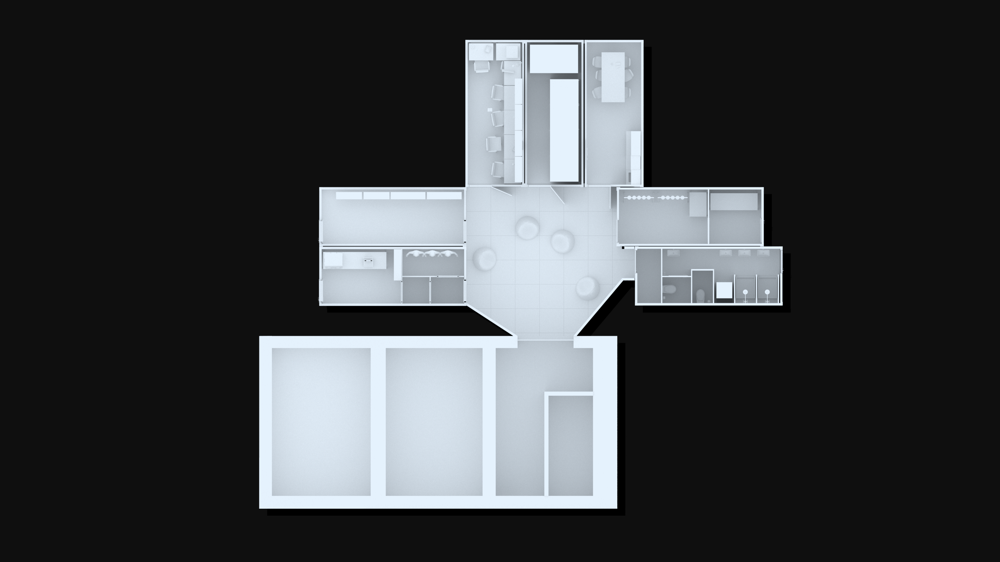
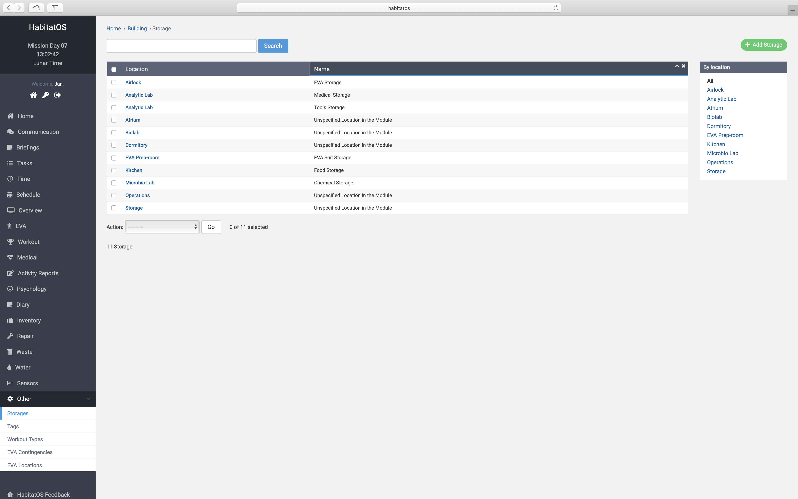
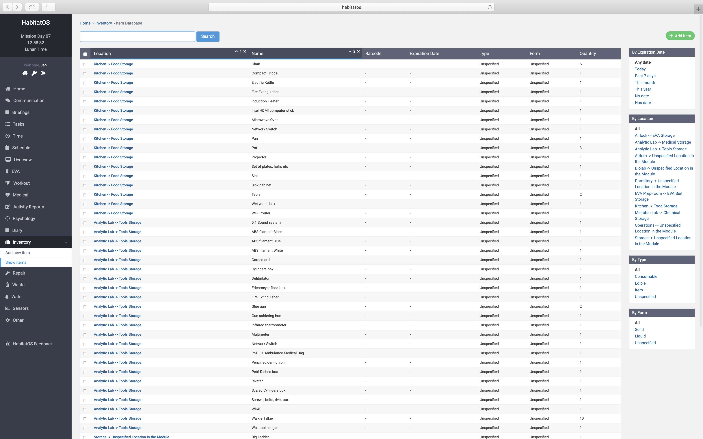

*****************
Podsystem budynku
*****************

Building
========
Habitat Lunares zbudowany jest z 6 modułów, atrium - części wspólnej oraz śluzy powietrznej. Wizualizacje rozkładu pomieszczeń przedstawiają :numref:`figure-system-building-inside-1` oraz :numref:`figure-system-building-inside-2`

    Wizualizacja pomieszczeń habitatu Lunares. Wizualizację wykonano 21 sierpnia 2018 r. Źródło: Agata Mintus. :cite:`Mintus2018`

    Wizualizacja pomieszczeń habitatu Lunares. Wizualizację wykonano 21 sierpnia 2018 r. Źródło: Agata Mintus. :cite:`Mintus2018`

W budynku znajdują się zlokalizowane na stałe powierzchnie magazynowe, tj. *storage room* oraz *EVA prep-room* jak również tymczasowe lokalizacje, w których przechowuje się urządzenia, narzędzia i zapasy. Charakterystyczne dla lokacji tymczasowych jest tworzenie się miejsc składowania w trakcie działań operacyjnych oraz w zależności od potrzeb (łac. *ad hoc*). System informatyczny wspierający załogę w śledzeniu stanów magazynowych jak również lokacji narzędzi i urządzeń musi wspierać tego typu składy. Na :numref:`figure-system-building-storage` przedstawiono ekran konfiguracji schowków i składów wspieranych przez *HabitatOS*, jak również listing :numref:`figure-system-building-inventory` przedmiotów i zasobów w nim się znajdujących.

    Ekran konfiguracji schowków oraz miejsc przechowywania urządzeń i zasobów.

Wszystkie zapasy w bazach kosmicznych muszą być strategicznie rozlokowane w różnych modułach, tak, aby wyłączenie jednego segmentu bazy nie spowodowało odcięcia załogi od zapasów. Powodem niedostępności modułu mogą być: awaria prądu, utrata integralności poszycia habitatu lub utrata ciśnienia. W przypadku wykrycia awarii system powinien powiadomić załogę oraz wspomóc w natychmiastowej izolacji modułu.

    Ekran listingu sprzętu wraz z wyświetleniem lokalizacji urządzenia lub zasobu. Panel filtracyjny po prawej stronie pozwala na ograniczenie listy wyświetlanych elementów wg wskazanych kryteriów, tj. miejsce przechowywania, typ, stan przechowywania (form), jak również data przydatności do spożycia (dot. produktów spożywczych, substancji chemicznych, materiałów psujących się oraz leków).
