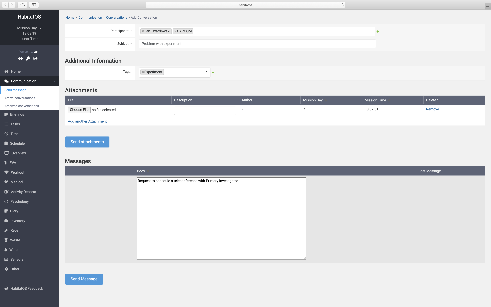
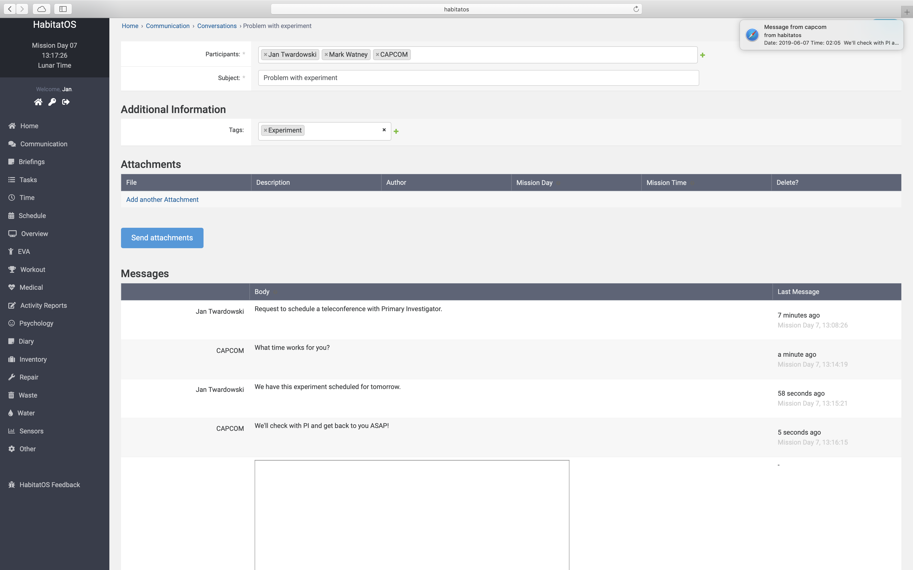
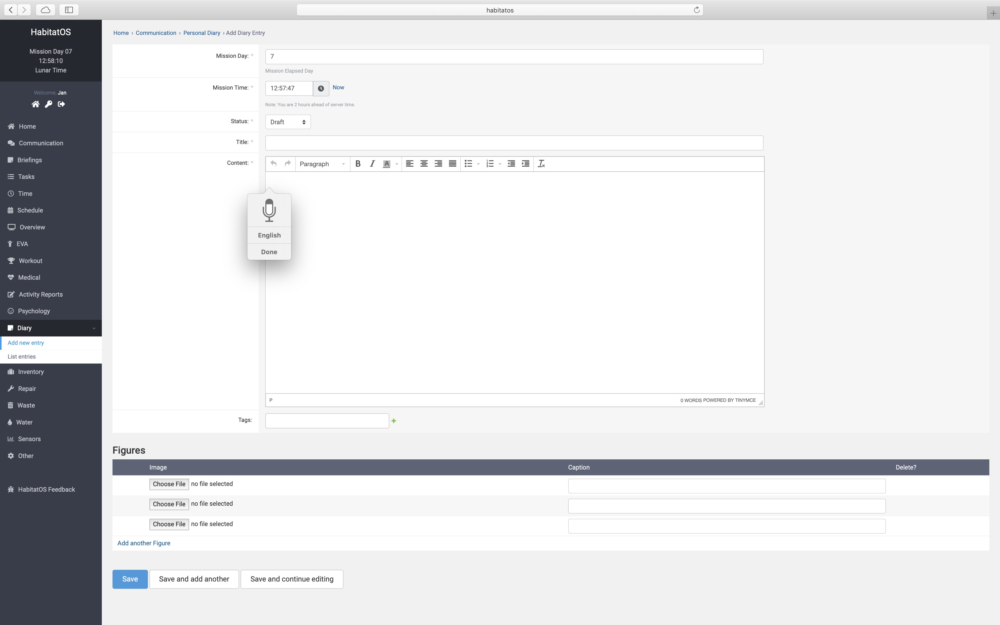

*********************
Podsystem komunikacji
*********************

Podsystem komunikacji składa się z dwóch głównych komponentów:

    * system komunikacji wewnętrznej,
    * system komunikacji zewnętrznej.

Cała komunikacja realizowana z habitatu podlega opóźnieniom czasowym wynikającym z prędkości światła. Opóźnienie jest zapewnione dla stron w komunikacji oddalonych od siebie, tzn. w przypadku komunikacji między członkami :term:`MCC` opóźnienie nie występuje. Podobnie również, gdy komunikacja odbywa się między członkami załogi astronautów. Wiadomości są natomiast opóźniane na styku kontaktu :term:`MCC` - astronauci.

Komunikacja wewnętrzna
======================
W celu zapewnienia wsparcia załogi podczas misji stworzono system komunikacji za pomocą wiadomości tekstowych. System umożliwia prowadzenie rozmowy wielostronnej (:numref:`figure-system-communication-email-new`), tj. w której uczestniczyć mogą więcej niż dwie osoby, bez znaczenia na ich lokację. System wspiera opóźnienie komunikacyjne w wątkach prowadzonych w ramach takich rozmów. Opóźnienie jest względne, tzn. każda ze stron będzie widziała wiadomości zgodnie z czasem ich przyjścia wynikającym z limitu prędkości komunikacji.

    Zrzut ekranu systemu *HabitatOS* przedstawiający ekran tworzenia nowej konwersacji. Widoczne są opcje możliwości dołączania uczestników jak również kategoryzowania w celu łatwiejszego wyszukiwania. Do wiadomości można dodawać załączniki.

Przykładem takiej sytuacji może być komunikacja przedstawiona na :numref:`figure-system-communication-email-listing` W ramach konwersacji udział biorą trzy strony (imiona i nazwiska zostały zmienione):

    * Jan Twardowski - astronauta,
    * Mark Watney - astronauta,
    * :term:`CAPCOM` - w ramach :term:`MCC`.

W trakcie konwersacji astronauci widzą swoje wiadomości natychmiastowo, natomiast :term:`CAPCOM` dostaje je z opóźnieniem. Podobnie wiadomości wysłane przez niego trafiają do obu astronautów w tym samym czasie, po uwzględnieniu opóźnienia. Podobnie w przypadku załączania plików do konwersacji przez którąś ze stron, czas ich pojawienia się u innych osób będzie zależał od odległości od osoby wysyłającej plik z danymi.

    Zrzut ekranu systemu *HabitatOS* przedstawiający listing konwersacji. Na ekranie widać możliwość kategoryzacji wiadomości oraz filtrowania listy za pomocą poszczególnych parametrów.

System *HabitatOS* wspiera natywne systemowe powiadomienia. W przypadku otrzymania wiadomości *HabitatOS* wysyła komunikat do przeglądarki internetowej użytkownika z prośbą o wyświetlenie informacji w systemie operacyjnym komputera lub urządzenia mobilnego użytkownika. Komunikacja ta odbywa się w tle i nawet gdy *HabitatOS* nie jest otworzony w przeglądarce wiadomości z tego systemu są wyświetlane. Po kliknięciu w informację następuje przekierowanie do strony komunikacji do miejsca, w którym znajduje się dana wiadomość. Zrzut ekranu :numref:`figure-system-communication-email-notification` demonstruje działanie funkcjonalności.

    System *HabitatOS* powiadamia użytkownika o nowych wiadomościach poprzez wyświetlenie komunikatu w systemie operacyjnym użytkownika. Komunikat widoczny jest w prawym górnym rogu zrzutu ekranu. Na rysunku przedstawiono również widok rozmowy.

Komunikacja zewnętrzna
======================
Jednym z celów prowadzenia symulacji oraz docelowych misji kosmicznych jest działalność popularyzująca naukę i eksplorację kosmosu. W celu skutecznego przekazywania informacji oraz efektywnej komunikacji konieczne jest wprowadzenie w systemie możliwości współdzielenia się materiałami multimedialnymi tj. video, audio oraz publikacjami tekstowymi: materiały prasowe, notki, blog-posty, tweety, zmiany statusów w mediach społecznościowych itp.

*HabitatOS* posiada moduł umożliwiający tego typu aktywność. :numref:`figure-system-communication-diary` przedstawia ekran publikacji notki blogowej wraz z możliwością dyktowania tekstu. Komputer po analizie wprowadzonego materiału audio zamienia go w tekst. Dostępna jest obsługa wielu języków.

    Ekran publikacji notki blogowej wraz z możliwością dyktowania tekstu. Komputer po analizie wprowadzonego materiału audio zamienia go w tekst. Dostępna jest obsługa wielu języków.
