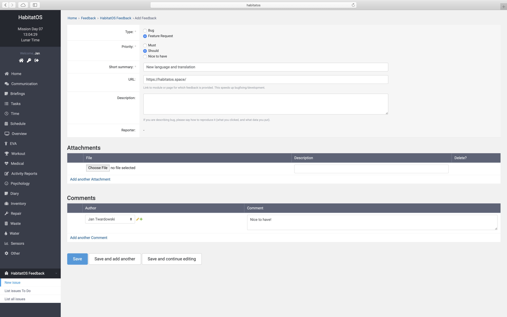

***************
Podsystem jądra
***************

System *HabitatOS* zbudowany jest w architekturze mikrousługowej, tj. posiada wiele niezależnych komponentów, które wymieniają ze sobą informację. W celu zapewnienia bezpieczeństwa danych, cała transmisja odbywa się w sposób szyfrowany wraz z dwustronną weryfikacją końcówek. Bezpieczeństwo zapewnione jest również na poziomie użytkowników.

System uprawnień usług pozwala na walidację czy dany komponent ma uprawnienia do korzystania z zasobów głównego systemu. Dzięki takiej budowie istnieje możliwość stworzenia architektury opartej na modelu subskrybentów i pisarzy, tj. usługi będą rejestrowały zdarzenia w centralnym systemie, który będzie odpowiedzialny za ich przechowywanie, jak również dystrybucję (w ramach uprawnień) do poszczególnych podsystemów. System ten z powodzeniem stosowany jest w dużych firmach i złożonym, rozproszonym oprogramowaniu.

Uwierzytelnianie użytkowników
=============================
Wszyscy uczestnicy symulacji mają konta imienne w systemie i są przypisani zarówno do grup jak i do ról. Dostęp do kont jest wyłącznie za pomocą wygenerowanego indywidualnie hasła. Komponent ``Auth`` (ang. *authentication*) (:numref:`figure-system-core-auth-users`) zajmuje się uwierzytelnianiem użytkowników jak również weryfikacją ich uprawnień i przynależności do grup. System pozwala na tymczasowe wyłączanie kont, jak również na stałe ich blokowanie bez konieczności usuwania. Dzięki temu informacje o akcjach wykonanych przez użytkownika pozostają w systemie.

    Lista użytkowników systemu *HabitatOS*. Po prawej stronie znajdują się filtry umożliwiające ograniczanie ilości wyświetlanych wyników. Powyżej listy znajduje się wyszukiwarka. Czerwone i zielone grafiki pozwalają na rozróżnienie stanu włączenia i wyłączenia konta w systemie.

Przynależność użytkownika do grupy pozwala na określanie uprawnień oraz zasięgu widoczności danych w systemie. :numref:`figure-system-core-auth-groups` przedstawia zestaw domyślnych grup w systemie. System pozwala na indywidualne rozszerzenie uprawnień dla poszczególnych użytkowników, jak również na tymczasowe podniesienie zasięgu widoczności, np. w trakcie zastępstwa innej osoby w danej roli.

    Zrzut ekranu systemu *HabitatOS* przedstawia zestaw domyślnych grup w systemie.

Zgaszanie błędów oraz sugestii nowych funkcjonalności
=====================================================
*HabitatOS* posiada niewielki komponent umożliwiający zgłaszanie błędów i problemów technicznych. Formularz pozwala na zbieranie informacji o nieprawidłowym działaniu jak również sugestiach usprawnień w jednym miejscu. :numref:`figure-system-core-feedback-add` przedstawia ekran zgłoszenia sugestii.

    Ekran zgłaszania sugestii systemu *HabitatOS*.
