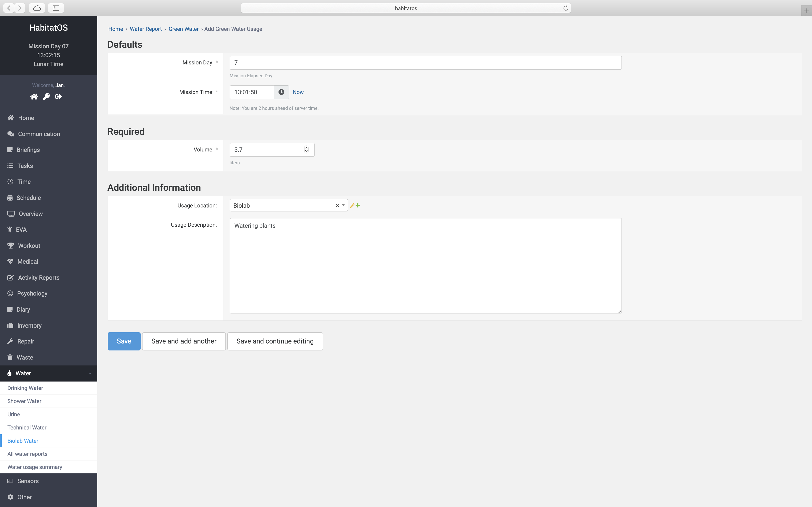
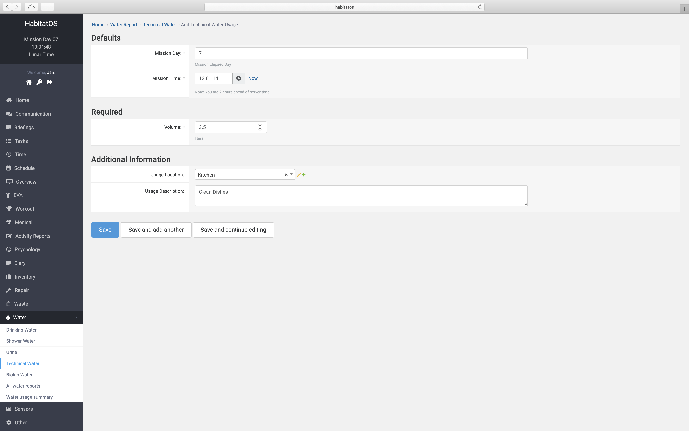
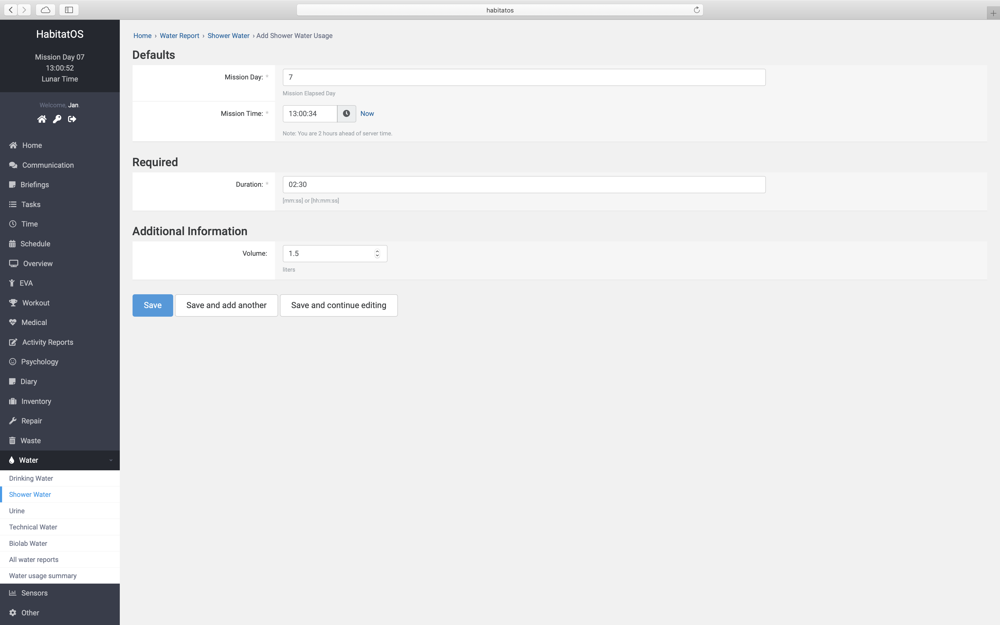
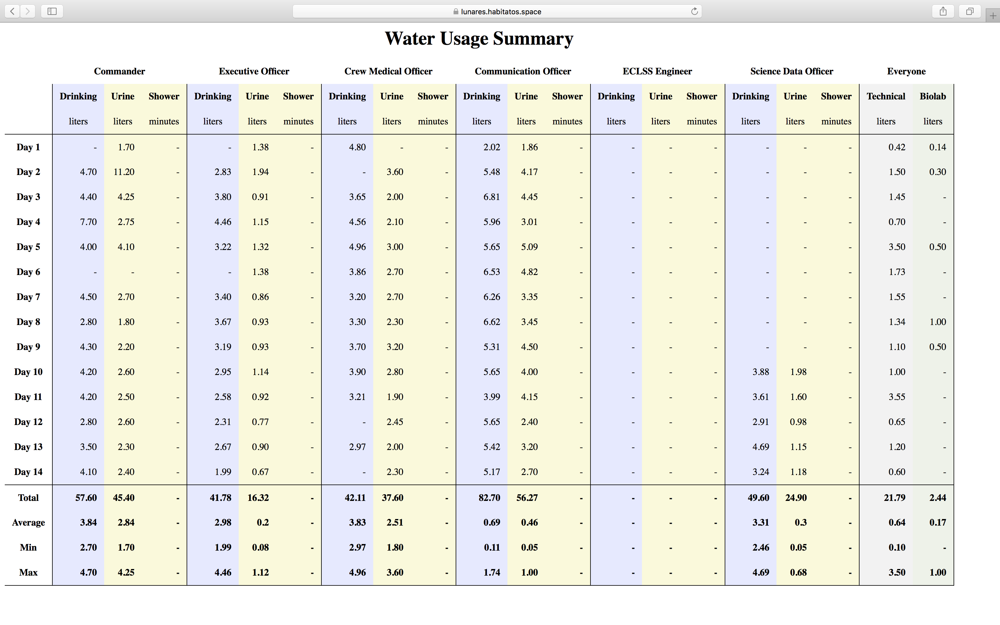
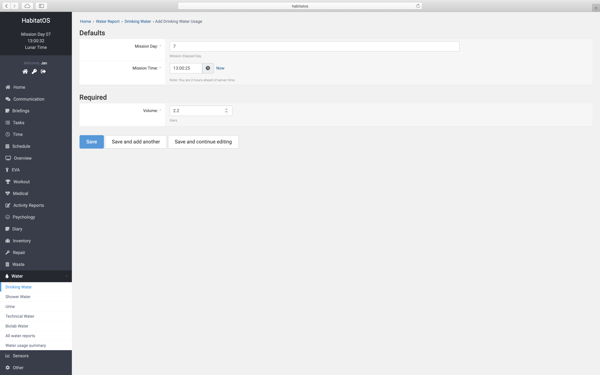
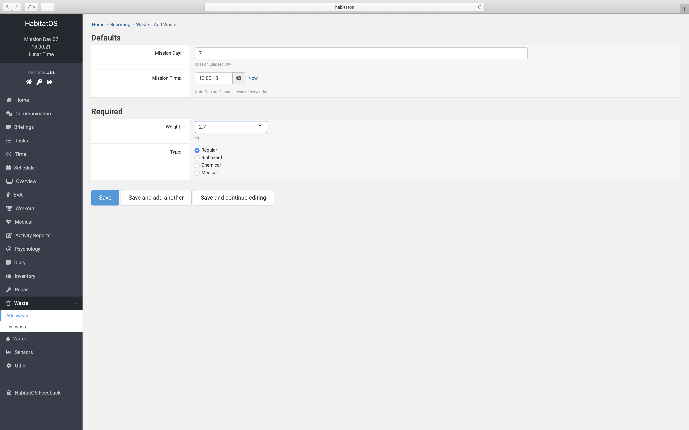

*****************************
Podsystem środowiska habitatu
*****************************

Obecnie nie istnieje system potrafiący dostosować parametry środowiskowe budynku do samopoczucia załogi. Na podstawie parametrów medycznych, zmierzonego stresu oraz produktywności, jakości snu itp. może dostosowywać temperaturę pomieszczeń, warunki oświetleniowe oraz wilgotność względną powietrza. *HabitatOS* w obecnej wersji nie posiada możliwości sterowania parametrami środowiskowymi habitatu, lecz jest to funkcjonalność, która zostanie zaimplementowana w systemie w niedługiej przyszłości.

Termoregulacja oraz kontrola wilgotności powietrza
==================================================
Budynek habitatu ma jak najbardziej odpowiadać warunkom panującym w przyszłych bazach kosmicznych. W celu utrzymania zdrowia załogi konieczny jest system termoregulacji. Obecne na rynku klimatyzatory posiadają sterowniki potrafiące utrzymać zadaną temperaturę. Takie też rozwiązanie zastosowano w habitacie.

*HabitatOS* na chwilę obecną monitoruje parametry atmosfery tj. temperatura oraz wilgotność względna w różnych miejscach habitatu. Na podstawie pomiarów dokonanych przez sensory wykreślane są statystyki i rozkłady dobowe oraz tygodniowe (:numref:`figure-system-sensor-chart`). Informacje te szczegółowo opisano w :numref:`Podsystem sensorów`

Skład atmosfery
===============
Atmosfera ziemska składa się w 78,09% z azotu, 20,95% z tlenu, 0,93% z argonu, 0,04% z dwutlenku węgla oraz pozostałych gazów :cite:`NASA1976`. Skład mieszanki gazowej atmosfery w bazie księżycowej musi podlegać ścisłej regulacji.

Ze względu na mikrograwitację w stacjach na niskiej orbicie okołoziemskiej (:term:`LEO`) proces samoistnej konwekcji ciepłego powietrza nie występuje. W środowisku zmniejszonego przyspieszenia grawitacyjnego: 1/6g dla Księżyca oraz 1/3g dla Marsa, proces konwekcji ciepłego powietrza jest spowolniony. Efekt ten powoduje tworzenie się lokalnych złogów CO2, które w ziemskich warunkach wymieszało by się z otaczającym powietrzem. Zarówno dla stacji na :term:`LEO` jak i baz kosmicznych konieczne jest sztuczne wymuszanie ruchów gazu.

Istotnym elementem jest generowanie tlenu koniecznego do oddychania i innych procesów komórkowych oraz likwidowanie CO2 z atmosfery, którego zwiększone stężenie szkodliwie wpływa na załogę.

System :term:`ECLSS` musi kontrolować zarówno skład atmosfery, jak również proces generowania O2, usuwania CO2 oraz mieszanie się gazów i ruch powietrza.

*HabitatOS* na chwilę obecną jedynie monitoruje wybrane parametry składowe atmosfery. W habitacie prowadzone będą badania dotyczące procesu usuwania (ang. *scrubbing*) CO2 z atmosfery, jak również generacja tlenu w reakcji Sabatiera. Po wdrożeniu stworzonych technologii *HabitatOS* ma kontrolować te procesy.

Ciśnienie atmosferyczne
=======================
W celu utrzymania atmosfery koniecznej do przeżycia koniecznym jest zapewnienie odpowiedniego ciśnienia atmosferycznego w bazie kosmicznej oraz wykrywanie nieszczelności w każdym z komponentów bazy. Atmosfera ziemska posiada średnie ciśnienie atmosferyczne, zmierzone na poziomie morza w wysokości 1013,25 hPa :cite:`NASA1976`. Wartość ta stanowi podstawę tzw. atmosfery standardowej. Ciśnienie w stacjach oraz bazach kosmicznych odpowiada ziemskiemu.

Zadaniem *HabitatOS* w przyszłości będzie kontrolowanie ciśnienia atmosferycznego oraz wykrywanie nieszczelności. System nie posiada jeszcze powyższej funkcjonalności, lecz za pomocą rozmieszczonych w bazie sensorów monitoruje powyższe wartości. Wykrywanie nieszczelności zostanie zrealizowane za pomocą uczenia maszynowego i algorytmów detekcji anomalii.

Zużycie i odzysk wody
=====================
Woda jest jednym najbardziej krytycznych zasobów w habitacie. Przeznaczenie wody jest uzależnione od miejsca jej wykorzystywana tj.:

    - woda zielona - woda do użytku w systemie hydroponicznym (:numref:`figure-system-eclss-water-biolab`),
    - woda niebieska - pitna (:numref:`figure-system-eclss-water-drinking`),
    - woda żółta - woda z systemu sanitarnego (:numref:`figure-system-eclss-water-shower`),
    - woda szara - woda do użytku technicznego (:numref:`figure-system-eclss-water-technical`).

W celu uzyskania zdatności do picia wody szarej, zielonej i żółtej należy zastosować odpowiednie filtrowanie, zarówno mechaniczne jak i biologiczne, oraz zastosować odparowywanie i skraplanie. W zależności od stopnia zabrudzenia i rodzaju skażenia proces uzdatniania się różni. Ponadto w habitacie *Lunares* prowadzone były badania nad tzw. odwrotną osmozą.

    Zrzut ekranu systemu *HabitatOS* przedstawia formularz wpisywania ilości jak również przeznaczenia zużycia wody wykorzystanej w hydroponice.

    Zrzut ekranu systemu *HabitatOS* przedstawia formularz wpisywania ilości jak również przeznaczenia zużycia wody technicznej.

Koniecznym jest monitorowanie wody w module sanitarnym. Ilość wody zużytej w procesie mycia, kąpieli czy odzyskiwana w postaci moczu lub innych płynów fizjologicznych podlega stałej regulacji. Ponadto woda pochodząca z systemu wydalniczego człowieka podlega analizie biomedycznej a dane dotyczące ilości są współdzielone z systemem medycznym.

    Zrzut ekranu systemu *HabitatOS* przedstawia formularz wpisywania ilości jak również przeznaczenia zużycia wody wykorzystanej w module sanitarnym.

W celu uniknięcia odwodnienia, które stanowi główny problem medyczny podczas symulacji ważna jest kontrola spożywania wody jak również monitorowania wydalania jej z organizmu.

Zestawienie wykorzystania wody z podziałem na uczestników misji, jak również w ujęciu zbiorczym dla wody szarej i zielonej przedstawia :numref:`figure-system-eclss-water-usage`

    Zestawienie wykorzystania wody z podziałem na uczestników misji, jak również w ujęciu zbiorczym dla wody szarej i zielonej.

    Zrzut ekranu systemu *HabitatOS* przedstawia formularz wpisywania ilości jak również przeznaczenia zużycia wody wykorzystanej do picia.

Monitoring odpadów i produktów przemiany
========================================
Zarówno w trakcie trwania misji jak również w czasie symulacji produkowana jest znaczna część materiału niezdatnego do dalszego przetworzenia lub recyklingu. Koniecznym jest monitorowanie ilości produkowanych śmieci, jak również rodzaju odpadków, ich stopnia skażenia lub zagrożenia dla zdrowia i życia załogi.

    Zrzut ekranu systemu *HabitatOS* przedstawia formularz uzupełniania danych dotyczących śmieci.

