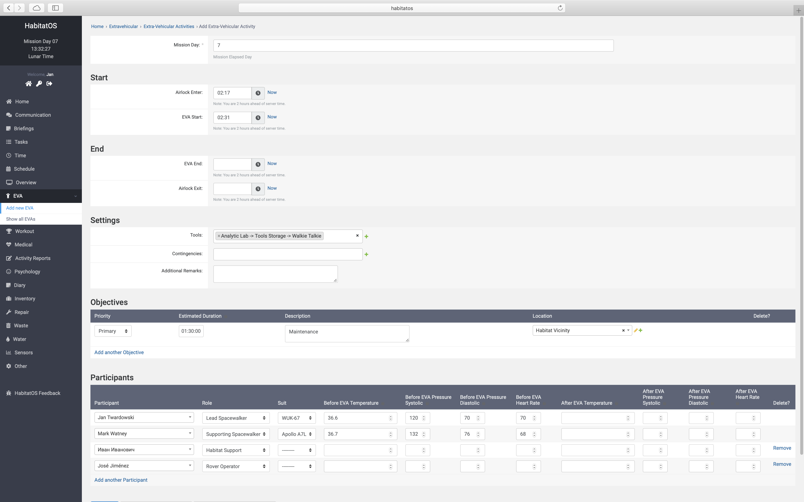

******************************
Podsystem spacerów kosmicznych
******************************

Głównym celem misji kosmicznych na inne ciała niebieskie tj. Mars, Księżyc, Phobos, Deimos czy asteroidy są eksploracja powierzchni, badania geologiczne i geofizyczne. W celu dokonania pomiarów geofizycznych konieczne jest rozstawienie urządzeń grawimetrycznych, magnetometrycznych, sejsmometrycznych, elektrooporowych jak również petrograficznych. Ponadto do sprawnego działania bazy konieczna jest instalacja ogniw fotowoltaicznych, anten zapewniających łączność z Ziemią oraz utrzymanie w stanie gotowości statków zapewniających powrót.

:term:`EVA` jest jednym z najniebezpieczniejszych elementów misji, gdyż astronauci narażeni są dodatkowo na czynniki zewnętrzne, tj. zwiększone promieniowanie kosmiczne i jonizujące, fluktuacje temperatury w cyklu dobowym jak również penetracje mikrometeorytami. Skafandry ochronne, które zapewniają system podtrzymania życia oraz częściową ochronę przed powyższymi zagrożeniami są toporne w użyciu i ograniczające ruchy. Może to spowodować zwiększenie wysiłku u astronautów, szczególnie podczas utraty stabilności i wywrócenia się na powierzchnię. Wynikająca z zasady bezwładności oraz braku oporu powietrza niezatrzymana rotacja może negatywnie wpływać na stawy i osłabiony ekspozycją na środowisko kosmiczne układ kostny i mięśniowy.

Planowanie
==========
System *HabitatOS* uwzględnia powyższe czynniki przy planowaniu :term:`EVA`.

Ekran rejestracji spaceru kosmicznego (:numref:`figure-system-eva-add`) pozwala na rejestrację podstawowych parametrów, tj.:

    - czas rozpoczęcia i zakończenia spaceru,
    - czas kompresji i dekompresji w śluzie powietrznej,
    - przypisanie do roli podczas spaceru kosmicznego,
    - planowane zadania główne i poboczne (:numref:`EVA Objectives`)
    - planowany teren eksploracji (:numref:`EVA Environment`),
    - wykonanie podstawowych badań medycznych przed i po :term:`EVA` (:numref:`EVA Biomedical`),
    - przypisanie do używanego skafandra (:numref:`EVA Suit`),
    - użyte narzędzia (:numref:`EVA Tools`),
    - napotkane niebezpieczeństwa (:numref:`EVA Contingency`).

Astronauci podczas spacerów kosmicznych mogą pełnić jedną z następujących ról:

    - dowódca (ang. *Lead Spacewalker*, *EV1*),
    - członek zespołu powierzchniowego (ang. *EV2* i kolejne)
    - wsparcie habitatowe,
    - operator robotyczny.

Zarówno osoby zajmujące role wsparcia habitatowego jak i robotycznego nie opuszczają bazy kosmicznej (:term:`IVA`) i wykonują czynności operacyjne zdalnie komunikując się z załogą zespołu powierzchniowego oraz z dowódcą.

    Zrzut ekranu systemu *HabitatOS* przedstawiający ekran rejestracji podstawowych parametrów spaceru kosmicznego.

.. _EVA Objectives:

Cele i kategoryzacja
====================
Spacery kosmiczne mogą należeć do jednej z następujących kategorii:

    - eksploracyjne (planowane) - odkrywanie nowych terenów,
    - badawczo naukowe (planowane) - wykonywanie badań biologicznych, geologicznych, geofizycznych,
    - inżynieryjne i testowe (planowane) - ewaluacja sprzętu,
    - operacyjne (planowane), tj. celem wykonania pracy np. wydobycia, budowy, podjęcia :term:`cargo` itp.,
    - dochodzenie w miejscu wypadku celem ustalenia przyczyny (planowane),
    - służące utrzymaniu habitatu i sprzętu (planowane i nieplanowane),
    - awaryjne (nieplanowane).

Awaryjne wyjścia :term:`EVA` są nieplanowane i dotyczą:

    - ewakuacji celem udzielania pomocy medycznej astronautom podczas :term:`EVA`,
    - ochrony lub ucieczki przed zagrożeniem w bazie (eksplozja, utrata ciśnienia, promieniowanie, utrata integralności poszycia habitatu, skażenie chemiczne, itp.),
    - naprawy krytycznych aspektów bazy i sprzętu uszkodzonego podczas działań operacyjnych, jak również w wyniku czynników środowiskowych.

Cele :term:`EVA` dzielą się na główne oraz poboczne. Realizacja celów głównych jest krytyczna dla powodzenia spaceru kosmicznego i dalszej ewaluacji astronauty. Natomiast cele poboczne są pracami dodatkowymi, których wykonanie przyniesie korzyść, lecz nie determinuje powodzenia operacji. Każdy cel musi zostać określony wg.:

    - planowanego czasu wykonania,
    - ewaluacji potencjalnych zagrożeń,
    - kryteriów wykonania,
    - lokalizacji,
    - narzędzi wymaganych do realizacji celu.

.. _EVA Environment:

Środowisko
==========
Celem budowy bazy na Księżycu czy Marsie jest eksploracja zasobów lokalnych, prowadzenie badań w terenie podczas :term:`spacerów kosmicznych <EVA>` jak również zapewnienie bezpiecznego życia w habitacie, uprawa roślin, hodowla zwierząt, produkcja materiałów, kolonizacja i docelowo turystyka kosmiczna. System operacyjny bazy planetarnej musi wspierać wykonywanie tego typu zadań.

Mars nie posiada pola magnetycznego, a Księżyc ma je szczątkowe. W obu przypadkach pole magnetyczne nie pozwala na nawigację w terenie, np. za pomocą kompasu. Niemożliwe jest także skorzystanie z systemu nawigacji satelitarnej, gdyż na chwilę obecną taka usługa jest niedostępna w obu środowiskach - brak odpowiedniego pokrycia satelitami. System musi zapewniać możliwość poruszania się i nawigowania w terenie wykorzystując alternatywne metody, jak również pozwalać na wykorzystanie różnych formatów podawania współrzędnych geograficznych jak siatka kartezjańska, układ biegunowy, walcowy czy sferyczny.

W *HabitatOS* stworzono moduł pozwalający na określanie stref powierzchniowych w celu późniejszej eksploracji. Każda ze stref jest oznaczona zestawem współrzędnych geograficznych, tj. długość i szerokość geograficzna, wysokość, kształt. Istnieje możliwość przypisania cech ukształtowania terenu oraz specyfiki budowy geologicznej.

.. _EVA Biomedical:

Monitoring parametrów i funkcji życiowych
=========================================
Kluczowym elementem jest utrzymywanie kontroli nad parametrami życiowymi astronautów wykonujących spacery kosmiczne. Astronauci monitorowani są pod względem:

    - ilości tlenu (O2),
    - ilości dwutlenku węgla (CO2),
    - sprawności aerobowej (VO2Max),
    - temperatury (Temp),
    - saturacji (SpO2) i indeksu perfuzji (PI),
    - ciśnienia skurczowego i rozkurczowego (SYS/DIA),
    - częstości akcji serca (HR),
    - aktywności elektrycznej serca (ECG).

Wszystkie powyższe parametry transmitowane są ze skafandra w trybie rzeczywistym do systemu *HabitatOS*. Na ich podstawie można ustalić sprawność oraz bezpieczny limit operacyjny :term:`EVA`. Ponadto kontrolerzy misji wspierający astronautów podczas spacerów kosmicznych także muszą widzieć te pomiary z uwzględnieniem specyficznego dla lokalizacji opóźnienia czasowego.

.. _EVA Suit:

Skafandry kosmiczne
===================
Skafandry kosmiczne dzielą się na dwa główne rodzaje: :term:`IVA` oraz :term:`EVA`. Natomiast te ostatnie mogą przyjmować różne wersje w zależności od przeznaczenia. Lekkie skafandry eksploracyjne i ratownicze, dodatkowo wzmocnione skafandry przemysłu ciężkiego (górnictwo, wydobycie, odwierty, budownictwo). Wzmocnieniem może być dodatkowa powłoka ochronna, zbroja, czy również egzoszkielet.

Wszystkie skafandry w celu zwiększenia możliwości operacyjnych oraz elastyczności działają przy zmniejszonym ciśnieniu oraz zwiększonym ciśnieniu parcjalnym tlenu do 100% atmosfery. Przed wyjściem na spacer kosmiczny konieczne jest wykonanie tzw. procedury :term:`pre-breathing`. Procedura ma na celu oczyszczenie organizmu z resztek azotu w celu uniknięcia choroby dekompresyjnej (ang. *Decompression Sickness*, *DCS*).

W *HabitatOS* Każdemu członkowi załogi powierzchniowej można przypisać indywidualnie skafander użyty podczas :term:`EVA`.

.. _EVA Tools:

Narzędzia wykorzystywane podczas spacerów kosmicznych
=====================================================
Krytycznym elementem wpływającym na powodzenie zadania podczas :term:`EVA` jest możliwość wykorzystania dedykowanych urządzeń oraz narzędzi.

Wśród narzędzi można wyróżnić:

    - wiertarki,
    - haki,
    - śrubokręty,
    - zagarniarki i pojemniki,
    - kontenery i walizki do przechowywania próbek,
    - wózki i roboty transportowe,
    - czekany i raki,
    - młotki geologiczne,
    - szpadle i szufle,
    - młotki
    - i inne.

Dodatkowo w trakcie :term:`EVA` astronauci mogą użyć przyrządów do badań geologicznych, mikrobiologicznych, chemicznych i geofizycznych, tj.:

    - urządzenia pomiaru pola magnetycznego i grawitacyjnego,
    - urządzenia mierzące poziom promieniowania jonizującego i kosmicznego,
    - urządzenia badające skład atmosfery, kompozycję gleby, skład mineralny,
    - mapy, pomoce nawigacyjne,
    - i inne.

Każde z narzędzi przypisane jest do schowka, w którym się znajduje przed :term:`EVA`, jak również do głównego użytkownika podczas spaceru kosmicznego. Po zakończeniu działań operacyjnych astronauci rozliczają się z wykorzystanego sprzętu, odkładają narzędzia na miejsce składowania oraz podsumowują stan magazynowy i zgłaszają ewentualne straty. *HabitatOS* pozwala na powyższe czynności.

.. _EVA Contingency:

Wsparcie w sytuacjach awaryjnych
================================
Podczas spacerów kosmicznych może dojść do niezaplanowanych wydarzeń, tj.:

    - upadek statyczny, dynamiczny i z wysokości (zsunięcie się z osuwiska, odpadnięcie od krawędzi skalnej),
    - obrażenia wywołane penetracją skafandra (przebicia)
    - skręcenia, złamania, zwichnięcia, zerwania stawów,
    - utraty przytomności,
    - zatrucia CO2,
    - ewakuacja i transport poszkodowanego astronauty,
    - wybuchy,
    - utrata łączności,
    - rozszczelnienia skafandra,
    - utrata zasilania skafandra,
    - awaria sprzętu systemu :term:`ECLSS` skafandra.

System *HabitatOS* wspiera możliwość określania wystąpienia powyższych sytuacji nieprzewidzianych oraz umożliwia dodawanie i raportowanie nowych wydarzeń.

Wsparcie robotyczne
===================
Astronautów podczas spacerów kosmicznych (ang. *Extravehicular Activity*, *EVA*) wspierają autonomiczne oraz sterowane z bazy roboty, z którymi musi być zapewniona łączność. W skład floty zrobotyzowanych pojazdów mechanicznych wchodzą:

    - pojazdy transportu załogi,
    - łaziki transportowe,
    - łaziki eksploracyjne,
    - roboty w konfiguracji sanitarnej,
    - latające wirokoptery,
    - autonomiczne ornitoptery,
    - drony odrzutowe (ze względu na szczątkową atmosferę na Księżycu niepozwalającą na unoszenie się za pomocą siły nośnej),
    - robotyczne koparki,
    - ramiona robotyczne,
    - robotyczne urządzenia wiertnicze i drążące,
    - inne niesklasyfikowane.

Inteligentny system obsługi bazy kosmicznej musi wspierać zarządzanie flotą oraz komunikację zarówno między astronautami, astronautami-robotami, astronautami-MCC, robotami-MCC i wewnątrz MCC.
