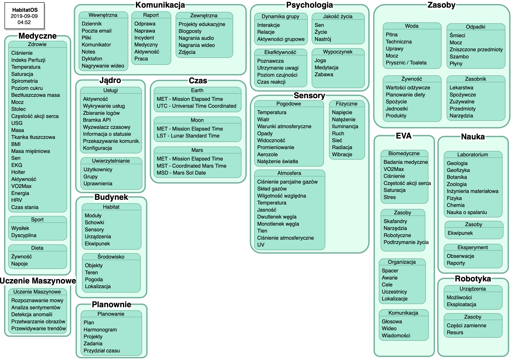
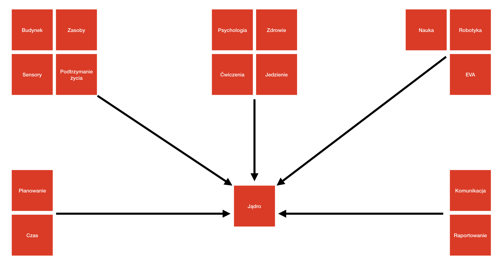

*******************
Architektura System
*******************

System *HabitatOS* podzielony jest na szereg komponentów odpowiadających elementom bazy kosmicznej jak i specyfice misji. Podział przedstawiony jest na :numref:`figure-system-architecture-component`, gdzie wyszczególniono obszary komponentów oraz wypisano modele danych składających się na dane rozwiązanie.

Do głównych komponentów systemu zaliczyć można:

    - :ref:`podsystem budynku`,
    - :ref:`podsystem komunikacji`,
    - :ref:`podsystem środowiska habitatu`,
    - :ref:`podsystem spacerów kosmicznych`,
    - :ref:`podsystem biomedyczny`,
    - :ref:`podsystem planowania zadań`,
    - :ref:`podsystem psychologiczny`,
    - :ref:`podsystem sensorów`,
    - :ref:`podsystem jądra`,
    - :ref:`podsystem czasu`.

Ponadto w *HabitatOS* w trakcie tworzenia są następujące moduły:

    - podsystem uczenia maszynowego,
    - podsystem zasobów,
    - podsystem robotyczny,
    - podsystem naukowy.

Szczegółowy podział oraz uzasadnienie każdego z przedstawionych komponentów jest opisany w poniższym rozdziale.

    Schemat podziału komponentów w systemie *HabitatOS*.

    Schemat podziału komponentów w systemie *HabitatOS*.

.. toctree::
    :maxdepth: 1

    /system/building.rst
    /system/communication.rst
    /system/core.rst
    /system/eclss.rst
    /system/eva.rst
    /system/medical.rst
    /system/planning.rst
    /system/psychology.rst
    /system/report.rst
    /system/sensor.rst
    /system/time.rst
    /system/workout.rst
