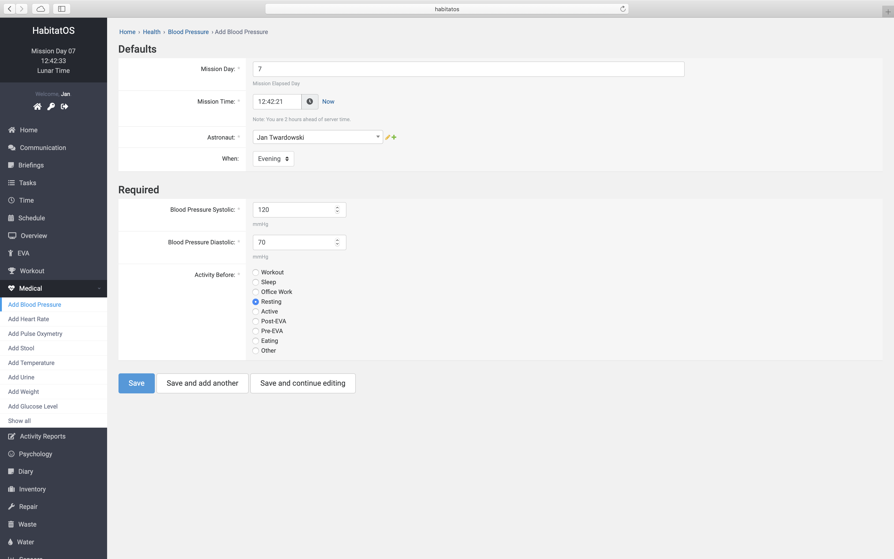
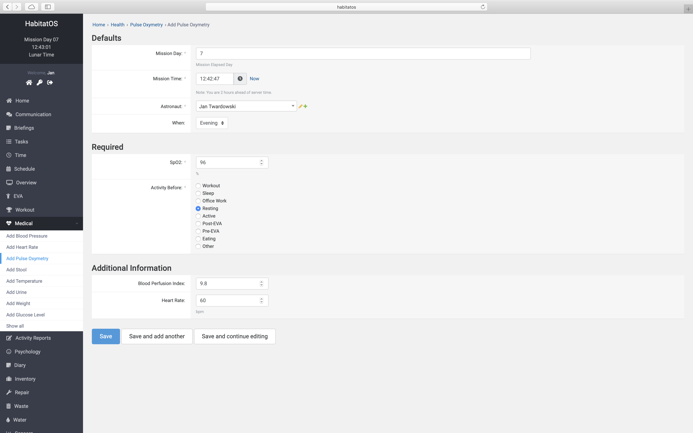
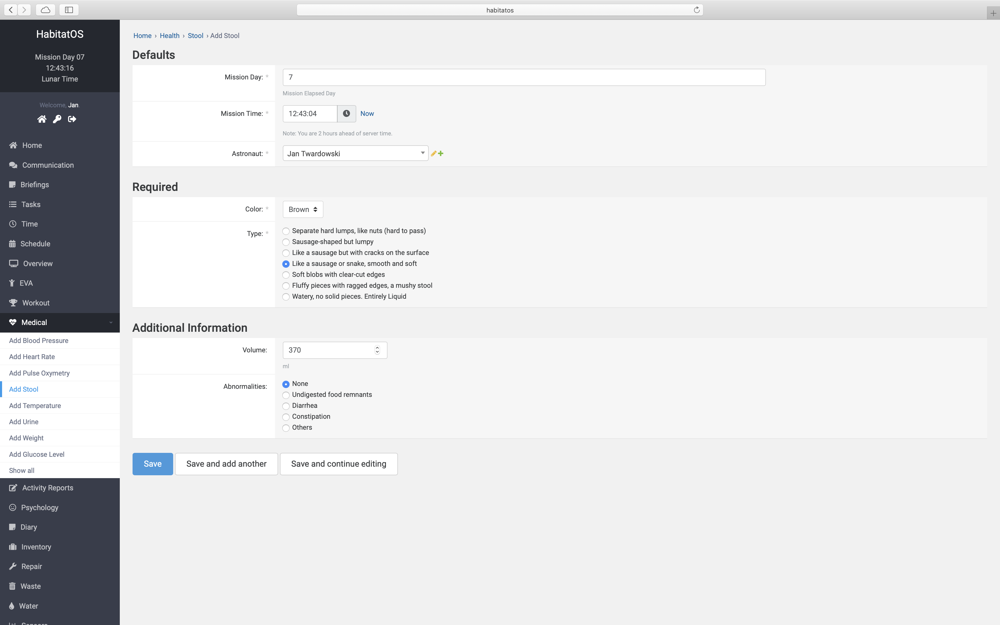
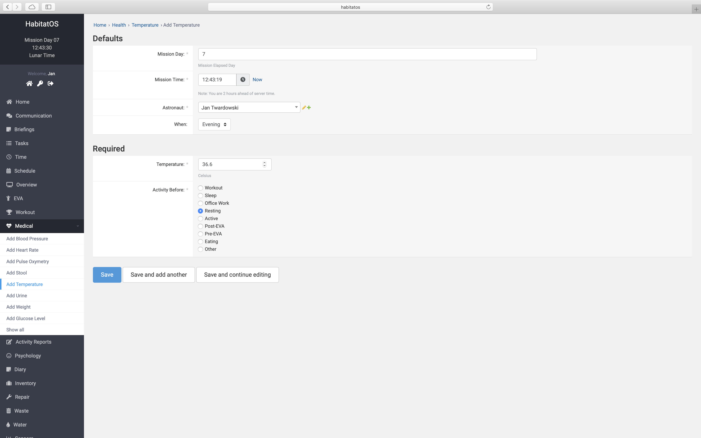
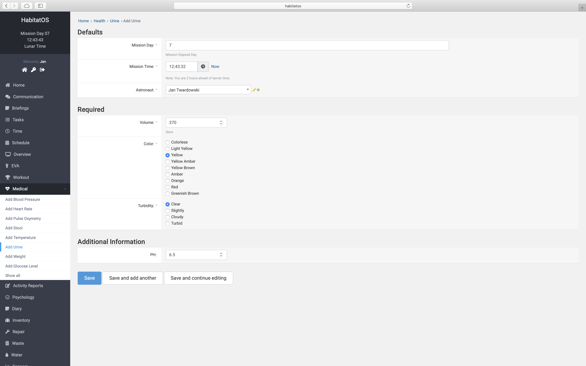
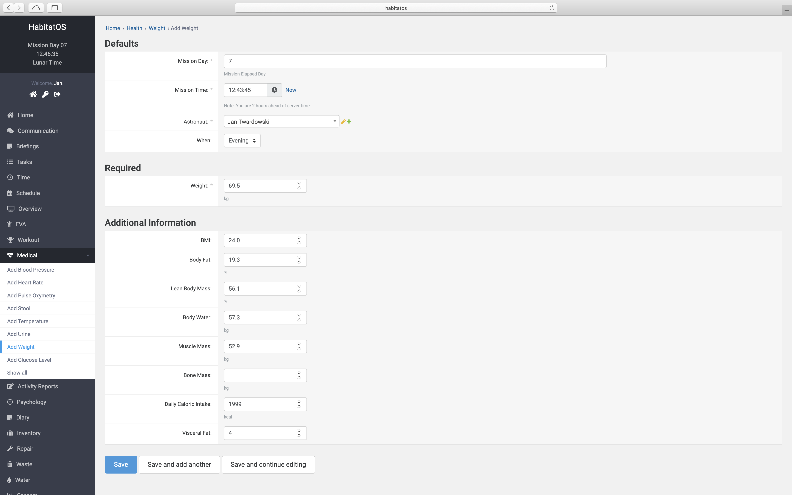

*********************
Podsystem biomedyczny
*********************

Podczas symulacji misji kosmicznych zbierane są następujące parametry biomedyczne członków załogi:

    - skurczowe i rozkurczowe ciśnienie krwi (BP SYS/DIA),
    - poziom glukozy we krwi,
    - częstość akcji serca (HR),
    - saturacja (SpO2),
    - stolec,
    - temperatura wewnętrzna i zewnętrzna ciała (Temp),
    - mocz,
    - masa.

Skurczowe i rozkurczowe ciśnienie krwi
======================================
Do pomiarów skurczowego (ang. *systolic*, *SYS*) i rozkurczowego (ang. *diastolic*, *DIA*) ciśnienia krwi (ang. *blood pressure*, *BP*) użyte zostały urządzenia firmy *iHealth Labs* ze względu na możliwość integracji oraz eksportu danych. W trakcie misji wykorzystywane są: *iHealth Clear* oraz *iHealth BP5*. Istnieje również możliwość wprowadzania danych ręcznie w wyniku pomiaru innym urządzeniem (:numref:`figure-system-medical-blood-pressure`)

    Zrzut ekranu systemu *HabitatOS* przedstawiający ekran wprowadzania manualnego danych pomiarów skurczowego i rozkurczowego ciśnienia krwi.

Wprowadzone wartości ciśnienia krwi są kategoryzowane przez *HabitatOS* zgodnie z algorytmem opracowanym przez *American Heart Association* w 2018 roku :cite:`Whelton2018`.

.. csv-table:: Klasyfikacja ciśnienia krwi u dorosłych wg. *American Heart Association* :cite:`Whelton2018`
    :name: table-system-medical-heart-rate
    :header:  "Kategoria", "Skurczowe [mm Hg]", "Operator", "Rozkurczowe [mm Hg]"

    "Normalne", "poniżej 120", "i", "poniżej 80"
    "Podwyższone", "120-129", "i", "poniżej 80"
    "Nadciśnienie stopień 1", "130-139", "lub", "80-89"
    "Nadciśnienie stopień 2", "140 lub wyższe", "lub", "90 lub wyższe"
    "Kryzys nadciśnieniowy", "powyżej 180", "i/lub", "Wyższe niż 120"

Poziom glukozy we krwi
======================
Poziom glukozy we krwi mierzony jest urządzeniem *iHealth Gluco+ smart glucometer (BG5S-kit)* firmy *iHealth Labs*. Urządzenie pozwala na pomiar w zakresie 20mg/dL - 600mg/dL przy kropli krwi min. 0.7 μL. Istnieje również możliwość wprowadzania danych ręcznie w wyniku pomiaru innym urządzeniem (:numref:`figure-system-medical-glucose`).

    Ekran wprowadzania pomiaru glukozy we krwi.

System *HabitatOS* klasyfikuje poziom cukru wg. *Expert Committee on the Diagnosis and Classification of Diabetes Mellitus* w 1997 roku :cite:`Diabetes1997`. Komisja przedstawiła następujący podział:

.. csv-table:: Klasyfikacja poziomu cukru we krwi wg. Expert Committee on the Diagnosis and Classification of Diabetes Mellitus :cite:`Diabetes1997`
    :name: table-system-medical-glucose
    :header:  "Kategoria", "Próg dolny [mg/dL]", "Próg górny [mg/dL]"

    "Hipoglikemia", "0", "40"
    "Niski", "40", "70"
    "Normalny", "70", "130"
    "Wysoki", "130", "180"
    "Hiperglikemia", "powyżej 180", "brak"

Częstość akcji serca
====================
*HabitatOS* pozwala na monitorowanie częstości akcji serca i wprowadzanie informacji (:numref:`figure-system-medical-heart-rate`) dotyczących tego pomiaru. Dane te trafiają do systemu wielokrotnie podczas dnia i pozwalają na odtworzenie aktywności wysiłkowej, jak również poziomu czujności i stanu pobudzenia. Są istotnym elementem analizy biomedycznej astronauty.

Częstość akcji serca (ang. *heart rate*, *HR*) to jeden z najbardziej podstawowych parametrów biomedycznych, który pozwala m.in. na określenie poziomu stresu, czujności, stanu pobudzenia oraz wydolności organizmu. Wartości poniżej 60 uderzeń na minutę (ang. *beats per minute*, *BPM*) są traktowane jako bradykardia, a powyżej 100 uderzeń jako tachykardia. Spoczynkowa częstość akcji serca u dorosłego człowieka wynosi około 70 uderzeń na minutę. U trenujących sportowców ta wartość może ulec obniżeniu, nawet poniżej progu bradykardii :cite:`Ward1992`. Podczas snu puls również ulega obniżeniu do 40-50 uderzeń na minutę :cite:`NHLBI`.

    Wprowadzanie częstości akcji serca do *HabitatOS*. System pozwala na określenie czynności wykonywanej bezpośrednio przed pomiarem.

Saturacja
=========
System *HabitatOS* pozwala na określenie czynności wykonywanej bezpośrednio przed pomiarem. Ponadto istnieje możliwość zapisania wartości Indeksu Perfuzji i częstości akcji serca. Dane te są zwykle mierzone jednocześnie.

Saturacja (SpO2) to pomiar nasycenia krwi tętniczej tlenem w celu określenia niewydolności oddechowej. Pomiar oznacza procent związania hemoglobiny we krwi z tlenem. Pomiar saturacji wykonywany jest urządzeniem zwanym pulsoksymetrem i opiera się na zasadzie absorpcji światła charakterystycznej dla oksyhemoglobiny. Saturacja poniżej 90% oznacza niedotlenienie, które może być spowodowane m.in. przez pogorszenie wentylacji płuc. Oczekiwane wartości znajdują się w przedziale 94-98% :cite:`McClatchey2002`.

    Wprowadzanie poziomu saturacji do *HabitatOS*. System pozwala na określenie czynności wykonywanej bezpośrednio przed pomiarem. Ponadto istnieje możliwość zapisania wartości Indeksu Perfuzji (ang. *Perfusion Index*, *PI*) i częstości akcji serca. Dane te są zwykle mierzone jednocześnie.

Stolec
======
Stolec (ang. *stool*) to efekt przemiany materii w formie ciała stałego, półstałego lub postaci płynnej. W skład kału wchodzą m.in. resztki pokarmowe, śluz, bakterie, resztki nabłonka, woda. Za brązowawy kolor stolca odpowiadają produkty rozpadu hemoglobiny tj. bilirubina i biliwerdyna. Prawidłowe wydalanie stolca odbywać się ono powinno 1–2 razy na dobę, a spoistość stolca powinna być prawidłowa: ani za twarda, ani za wodnista. Wydalanie stolca odbywa się najczęściej w godzinach rannych. Ma to wpływ na zdrowie człowieka. Utylizacja ekskrementów jest istotnym problemem podczas misji kosmicznych w celu uniknięcia rozwoju bakterii cholery i duru brzusznego :cite:`Tortora1987`.

W systemie *HabitatOS* użyto klasyfikacji stolca zgodnie z bristolską skalą uformowania stolca (ang. *Bristol Stool Form Scale*, *BSF*). Skala wyróżnia siedem typów stolca :cite:`Lewis1997`:

    - Typ 1: Pojedyncze zbite grudki podobne do orzechów, trudne do wydalenia,
    - Typ 2: Stolec o wydłużonym kształcie, grudkowaty,
    - Typ 3: Stolec wydłużony, z pęknięciami na powierzchni,
    - Typ 4: Smukłe, wężowate kawałki stolca, gładkie i miękkie,
    - Typ 5: Miękkie drobiny z wyraźnymi krawędziami (łatwo wydalane),
    - Typ 6: Kłaczaste kawałki z postrzępionymi krawędziami,
    - Typ 7: Wodnisty, bez stałych elementów (ciecz).

System *HabitatOS* pozwala na określenie koloru, typu, objętości oraz podanie zauważonych odchyleń od normy.

    Zrzut ekranu systemu *HabitatOS* przedstawiający formularz wprowadzania pomiarów stolca. System *HabitatOS* pozwala na określenie koloru, typu, objętości oraz podanie zauważonych odchyleń od normy.

Temperatura
===========
Pomiar temperatury zewnętrznej jest pośrednim wskaźnikiem na temperaturę wewnętrzną. Od temperatury zależy prawidłowość przebiegu homeostazy człowieka. Normalną wartością temperatury u człowieka jest zakres 36-37 stopni, ze średnią wartością 36,6. Temperatura poniżej 36 stopni uznawana jest za hipotermię (trzy poziomy), a temperatura powyżej 37 za hipertermię. Zarówno hipotermia jak i hipertermia mogą powodować śmierć :cite:`SundLevander2002`.

Głównym czynnikiem wpływającym na podwyższenie temperatury jest odpowiedź immunologiczna organizmu podczas infekcji. Temperatura jest również wskaźnikiem pozycji w cyklu dobowym (ang. *Circadian rhythm*) z ekstremami około 4 rano (najniższa) i 17 (najwyższa). Pozwala na określenie występowania cyklu menstruacyjnego, ciąży, zaburzeń hormonalnych.

Metody pomiaru temperatury zewnętrznej:

    - w ustach (ang. *oral temperature*),
    - pod pachą (ang. *axillary temperature*),
    - w uchu (ang. *tympanic temperature*),
    - w nosie,
    - na czole,
    - na skroni.

Sposoby pomiarów temperatury wewnętrznej ciała:

    - doodbytnicze (ang. *rectal temperature*),
    - przełykowe (ang. *esophageal temperature*,
    - w pochwie (ang. *vaginal temperature*),
    - w pęcherzu moczowym.

.. csv-table:: Ogólna klasyfikacji temperatury wewnętrznej ciała :cite:`Walls2018`, :cite:`Axelrod2008`
    :name: table-medical-temperature-summary
    :widths: 15, 15, 5
    :header: "Stan", "Zakres temperatury", "Jednostka"

    "Hipotermia", "poniżej 35,0", "°C"
    "Normalna", "36,5 – 37,5", "°C"
    "Gorączka", "37,5 - 38,3", "°C"
    "Hipertermia", "38,3 - 40", "°C"
    "Hiperpyrexia", "powyżej 40,0", "°C"

.. csv-table:: Szczegółowa klasyfikacja temperatury wewnętrznej ciała :cite:`Walls2018`, :cite:`Axelrod2008`
    :widths: 10, 15, 75
    :name: table-medical-temperature-details
    :header: "Temperatura [°C]", "Klasyfikacja", "Objawy"

    "powyżej 44", "hipertermia", "Śmierć. Najwyższa zanotowana przeżywalność: 46,5 °C."
    "43", "hipertermia", "Śmierć lub poważne uszkodzenie mózgu, konwulsje i wstrząs, wysoce prawdopodobne zatrzymanie akcji sercowo-oddechowej"
    "42", "hipertermia", "Sinica lub zarumienienie, śpiączka, poważne delirium, wymioty, konwulsje, ciśnienie krwi może być zarówno wysokie jak i niskie, tachykardia."
    "41", "hipertermia", "Stan nagły. Utrata przytomności, silne bóle głowy, zawroty głowy, uczucie zagubienia, halucynacje, delirium, senność, palpitacje serca, duszność"
    "40", "hipertermia", "Stan zagrażający życiu. Utrata przytomności, odwodnienie, osłabienie, wymioty, bóle głowy, duszność, zawroty głowy, potliwość."
    "39", "hipertermia", "Obfita potliwość, zarumienienie, tachykardia, duszność, wycieńczenie, konwulsje (u osób z padaczką)"
    "38", "hipertermia", "Uczucie ciepła, potliwość, pragnienie, dyskomfort, niewielki głód, dreszcze (jeżeli pochodzi od gorączki)"
    "36,5 – 37,5", "normotermia", "Normalny zakres temperaturowy"
    "36", "hipotermia", "Uczucie zimna, drgawki. Normalna temperatura podczas snu."
    "35", "hipotermia", "Intensywne drgawki, odrętwienie, sinica, duszność, kołatanie serca, osłabienie, wycieńczenie"
    "34", "hipotermia", "Intensywne drgawki, utrata możliwości ruchu palców, sinica, zagubienie, zmiany osobowościowe"
    "33", "hipotermia", "Znaczne zagubienie, senność, spowolnienie odruchów, progresywna utrata drgawek, bradykardia, płytki oddech, zanik odpowiedzi na bodźce"
    "32", "hipotermia", "Stan nagły. Halucynacje, delirium, zagubienie, skrajna senność przechodząca w śpiączkę, zanik drgawek, uczucie ciepła, zanik odpowiedzi na bodźce"
    "31", "hipotermia", "Śpiączka, brak odpowiedzi na bodźce, płytki powolny oddech i bradykardia, arytmia serca"
    "28", "hipotermia", "Poważne zaburzenia rytmu serca, zanik oddechu"
    "poniżej 24–26", "hipotermia", "Śmierć w wyniku arytmii serca lub zatrzymania oddechu. Najniższa zanotowana przeżywalność: 14,2 °C."

*HabitatOS* umożliwia wprowadzanie informacji dotyczącej pomiarów temperatury ciała. System pozwala również na określenie czynności wykonywanej bezpośrednio przed badaniem.

    Zrzut ekranu systemu *HabitatOS* przedstawiający formularz wprowadzania temperatury ciała. System pozwala również na określenie czynności wykonywanej bezpośrednio przed badaniem.

Mocz
====
Podstawowa charakterystyka moczu obejmuje :cite:`Guyton2006`, :cite:`Rose2015`:

    - objętość w litrach,
    - skład,
    - kolor,
    - zapach,
    - mętność,
    - pH,
    - gęstość właściwa,
    - toksyczność,
    - bakterie i patogeny.

W trakcie prowadzenia symulacji misji kosmicznych, obiekty testowe aktywnie mierzą każdą ilość moczu i charakteryzują ją wg. koloru oraz mętności. :numref:`figure-system-medical-urine` przedstawia ekran wprowadzania informacji dotyczącej moczu. Podział ze względu na kolor obejmuje :cite:`Guyton2006`:

    - bezbarwny,
    - słomkowy,
    - żółty,
    - ciemnożółty,
    - żółtobrązowy,
    - bursztynowy,
    - pomarańczowy,
    - czerwony,
    - szarobrązowy.
    - zielony,
    - niebieski.

Mętność sklasyfikowana jest następująco :cite:`Rose2015`:

    - przejrzysty,
    - nieznacznie zawiesisty,
    - zawiesisty,
    - mętny.

    Zrzut ekranu systemu *HabitatOS* przedstawiający formularz wprowadzania informacji na temat moczu.

Masa ciała
==========
Masa ciała opisana jest za pomocą następujących parametrów:

    - waga,
    - indeks masy ciała (ang. *Body Mass Index*, *BMI*),
    - procentowy skład tkanki tłuszczowej,
    - beztłuszczowa masa ciała,
    - masa wody w ciele,
    - masa mięśniowa,
    - masa kostna,
    - zalecane dzienne spożycie kalorii,
    - tłuszcz trzewny.

Astronauci w trakcie symulowanych misji kosmicznych dwa razy w ciągu dnia korzystają z urządzenia określającego powyższe parametry. Informacje te są umieszczane w systemie informatycznym, z którym *HabitatOS* jest zsynchronizowany. Na podstawie zgromadzonych danych możliwe jest planowanie diety astronautów oraz analiza wpływu spożywanych pokarmów. :numref:`figure-system-medical-weight` przedstawia ekran wpisywania parametrów charakteryzujących pomiar masy ciała.

    Zrzut ekranu systemu *HabitatOS* przedstawiający zakres danych zbieranych podczas pomiaru masy i parametrów ciała.

Wraz z pozostałymi informacjami biomedycznymi oraz dotyczącymi aktywności sportowej możliwe jest określenie wpływu symulacji, żywienia oraz ćwiczeń na zdrowie uczestników.

