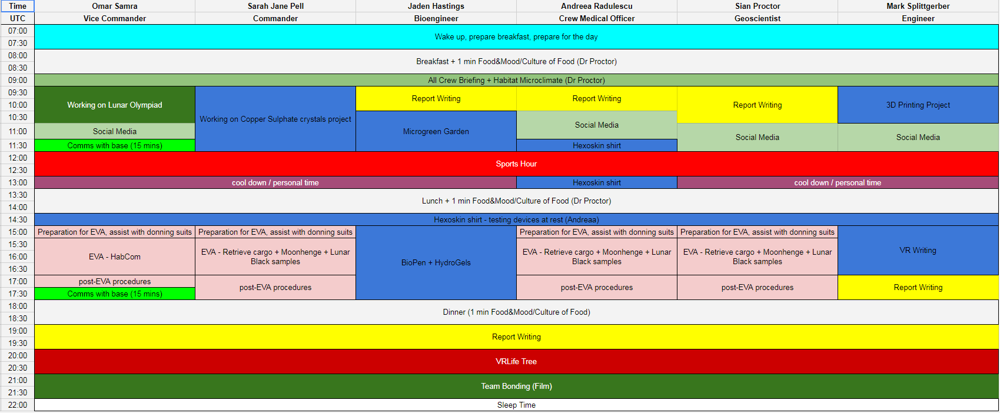
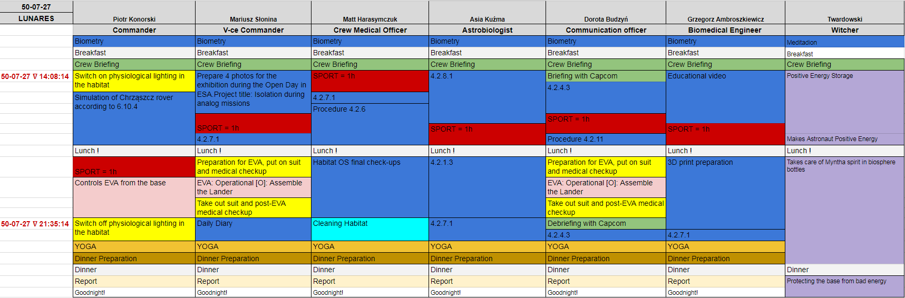
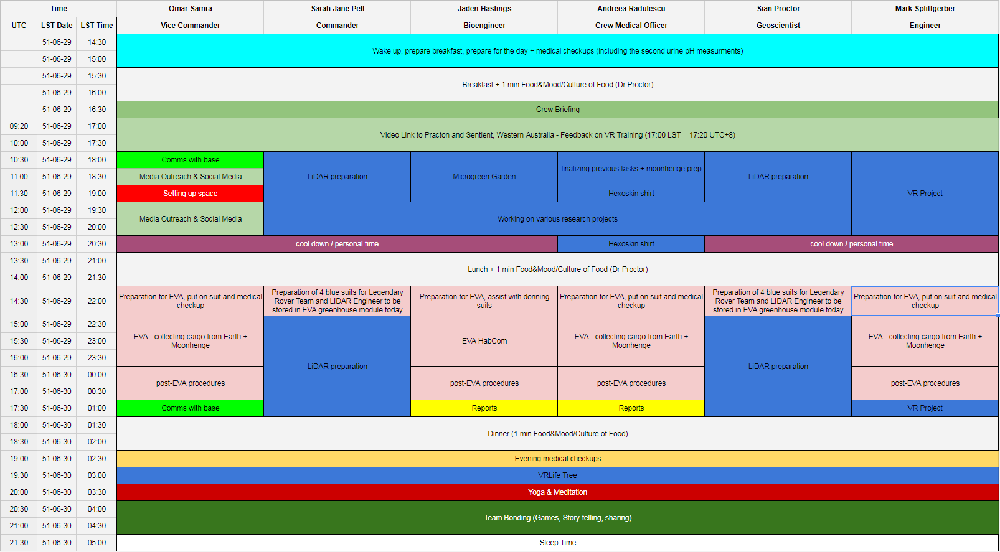
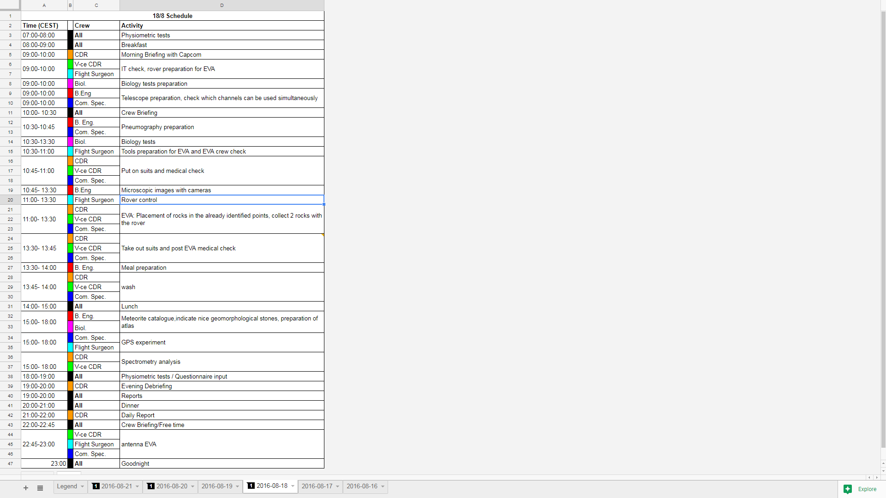

**************************
Podsystem planowania zadań
**************************

Kluczowym aspektem organizacji czasu pracy astronautów jest wykonywanie zadań zgodnie z harmonogramem. Tworzeniem planu zajmują się planiści układając przed misją grafik zadań na każdy dzień. W trakcie misji konieczna jest możliwość jego edycji, zarówno przez :term:`centrum kontroli misji <MCC>` jak i samych astronautów. Do takich zmian może dojść w wypadku opóźnień w pracy. Najczęściej wszelkie aktualizacje przeprowadzane są z Ziemi na prośbę astronautów.

Charakterystyka misji
=====================

Misje Księżycowe
----------------
Misje księżycowe i na niskiej orbicie okołoziemskiej cechują się brakiem istotnych opóźnień czasowych wpływających na skuteczność komunikacji. Pozwala to na tworzenie grafików z precyzyjnie zaplanowanymi dniami oraz czasem kontaktu ze wsparciem z Ziemi. Istnieje konieczność zaplanowania buforów czasowych pomiędzy zadaniami w celu uniknięcia przesunięć harmonogramu wskutek dłuższego wykonywania.

Misje Marsjańskie
-----------------
Dla misji marsjańskich, gdzie opóźnienie może wynosić od 4 do 22 minut, niemożliwe staje się śledzenie i precyzyjne umawianie spotkań oraz telekonferencji. Od załogi oczekuje się większej autonomii oraz samodzielnego układania planów dnia. Planiści skupiają się na tworzeniu tzw. szkieletów dni, tj. tworzenia propozycji planów z pustymi slotami do uzupełnienia wg. uznania astronautów. Aby zmniejszyć czasochłonność planowania dnia przez załogę planiści również rozwiązują zależności między zadaniami oraz sporządzają listę sugerowanych tematów.

Podsystem harmonogramu
======================
Harmonogram zadań musi pozwalać na śledzenie aktualnych zajęć wszystkich członków zespołu. Zadania muszą być podzielone ze względu na czas ich rozpoczęcia i zakończenia wykonywania oraz przydzielone zasoby ludzkie. Każdy wpis w planie dnia powinien umożliwiać podgląd szczegółów oraz na przejście do systemu pracy i wyświetlania procedury zadania.

    Zrzut ekranu systemu *HabitatOS* przedstawiający widok harmonogramu dnia podczas misji Spectra w sierpniu 2018 roku.

Wizualizacja planu dnia
-----------------------
W systemie *HabitatOS* istnieje możliwość wizualizacji planu dnia wraz z podziałem na role członków zespołu i sloty czasowe. Przykładowe ekrany zaplanowanych dni przedstawione są na zrzutach ekranu: :numref:`figure-system-planning-schedule-1`, :numref:`figure-system-planning-schedule-2`, :numref:`figure-system-planning-schedule-3`.

    Zrzut ekranu systemu *HabitatOS* przedstawiający widok harmonogramu dnia podczas misji LunEx w sierpniu 2017 roku. Na pasku czasu po lewej stronie widać wyświetlanie daty i czasu w formacie księżycowym (ang. *Lunar Standard Time*, *LST*). Precyzyjnie określone momenty to czas kontaktu z :term:`Centrum Kontroli Misji <MCC>`. Długość i terminowość wykonywania pozostałych czynności należała do zespołu, co było częścią jednego z eksperymentów. Oznaczenia numeryczne na planie dnia oznaczały identyfikatory zadań do wykonania zgodnie z Instrukcją Operacyjną Misji.

System operacyjny uwzględnia możliwość podawania i wyświetlania czasu w różnych strefach czasowych (:numref:`figure-system-planning-schedule-3`), tj. czas UTC, dowolna strefa czasowa na Ziemi, czas księżycowy, czas marsjański itp. Ponadto możliwe jest ukrycie dat i czasu, lub pozostawienie wybiórczych momentów, np. daty briefingu, w celu prowadzenia badań nad organizacją czasu.

    Zrzut ekranu systemu *HabitatOS* przedstawiający widok harmonogramu dnia podczas misji Spectra w sierpniu 2018 roku. Na pasku czasu po lewej stronie widać równoczesne wyświetlanie daty i czasu zarówno w strefie czasowej UTC, jak również w czasie księżycowym (ang. *Lunar Standard Time*, *LST*).

Podczas pierwszej misji w habitacie przetestowano wizualizację czasu dnia pracy zgodną z formatem wykorzystywanym przez NASA dla astronautów na Międzynarodowej Stacji Kosmicznej. Dostęp do układu grafiki uzyskano po konsultacji z kontrolerem lotu NASA Rolfem Erdmanem. Format ten zarówno dla zespołu jak i dla :term:`MCC` był nieczytelny i zrezygnowano z jego wykorzystywania w następnych dniach.

    Zrzut ekranu systemu *HabitatOS* przedstawiający harmonogram dnia analogiczny do wizualizacji wykorzystywanej na Międzynarodowej Stacji Kosmicznej we wczesnej fazie jej działania.

Planowanie czasu
----------------
System *HabitatOS* wspiera układanie harmonogramu w strefie czasowej:

    - czas UTC na Ziemi,
    - dowolna strefa czasowa na Ziemi,
    - dowolna strefa czasowa na Księżycu z uwzględnieniem opóźnienia czasowego oraz różną długość doby i miesiąca księżycowego,
    - dowolna strefa czasowa na Marsie z uwzględnieniem opóźnienia czasowego oraz różną długość doby.

System pozwala na konwersję przy wyświetlaniu czasu do dowolnej strefy pozwalając na układanie grafiku w naturalnym dla użytkownika lokalnym czasie.

*HabitatOS* pozwala na dekompozycję projektów na mniejsze zadania, które są umiejscowione w czasie ze wstępnie oszacowaną pracochłonnością.

Podczas symulacji misji kosmicznych wykorzystuje się wypracowane szkielety harmonogramu rozkładu dnia. W ramach rutynowych zadań wydzielić można:

    - poranną toaletę,
    - poranne badania medyczne,
    - przygotowanie posiłku i śniadanie,
    - slot czasowy na eksperymenty,
    - przygotowanie posiłku i obiad,
    - slot czasowy na eksperymenty,
    - przygotowanie posiłku i kolacja
    - wieczorne podsumowanie dnia,
    - czas na sporządzenie raportów,
    - wieczorne badania medyczne.

Ponadto w czasie dnia umieszczony jest slot czasowy dla zajęć sportowych. Ze względu na ograniczone zasoby siłowni, każdy z astronautów ma zaplanowany te aktywności w innym momencie dnia.

Dekompozycja tematów
--------------------
Zadania w systemie zgrupowane są w projekty. Pomiędzy zadaniami mogą występować zależności, np. zadanie B może być rozpoczęte tylko gdy wcześniej zadanie A zostało wykonane. Zależności mogą występować pomiędzy zadaniami z różnych projektów, lecz należy minimalizować taki stan rzeczy.

Projekty zgrupowane są tematycznie, tj. eksperymenty biologiczne, eksperymenty chemiczne, robotyka, utrzymanie systemów itp.

W celu podziału projektu na małe i niezależne zadania należy przeprowadzić tzw. proces dekompozycji. W trakcie ustalania szczegółów oraz analizy potrzeb sporządzana jest lista akcji wraz z określaniem szacowanej pracochłonności. Zadania następnie układane są chronologicznie zgodnie z kolejnością ich przyszłego wykonania a następnie nanoszone na grafik w systemie.

Układanie harmonogramu pracy
----------------------------
Przy układaniu harmonogramu pracy należy uwzględnić opóźnienia czasowe wynikające z odległości, jak również przesunięcia stref czasowych na Ziemi i innych ciałach niebieskich.

Każda zaplanowana aktywność wprowadzana jest do systemu. Wprowadzone informacje są dostępne zgodnie z uwzględnieniem opóźnienia czasowego, tj. np. po wprowadzeniu danych przez kontrolera lotu, zmiany będą widoczne natychmiast na Ziemi, a dopiero po upłynięcia stosownego czasu, np. 4-22 min dla Marsa, będą widoczne dla astronautów.

Przydzielanie zasobów
---------------------
Aby efektywnie zarządzać zadaniami i czasem pracy zadania przypisane są imiennie. Istnieje możliwość przydzielenia więcej niż jednej osoby do danego zadania. Osoba w zaplanowanym slocie czasowym powinna być dostępna w 100% w celu wykonania przydzielonego zadania.

Wykonywanie pracy
-----------------
Astronauci podczas wykonywania pracy w systemie mogą zasygnalizować informację o postępie prac nad danym zadaniem. Statusy określają obecny stan prac. Wśród możliwych opcji, w których może być zadanie można wyróżnić:

    - do zrobienia (ang. *To Do*),
    - w trakcie wykonywania (ang. *In Progress*),
    - zablokowane (ang. *Blocked*),
    - wykonane (ang. *Done*),
    - odrzucone (ang. *Won't Do*).

Przyczyną zablokowania zadania może być np. brak dostępnych materiałów do wykonania aktywności lub oczekiwanie na zwolnienie zasobu, tj. zakończenie poprzedniego wydruku na drukarce 3D w habitacie.

Raportowanie postępu wykonania pracy
------------------------------------
Astronauci potwierdzają rozpoczęcie prac poprzez zmianę stanu wykonywania zadania do stanu *In Progress*. Informacja po upływie zadanego opóźnienia trafia do kontrolerów :term:`MCC`. Po wykonaniu zadania status zmieniany jest na *Done*. W przypadku niepowodzenia wykonywania czynności i konieczności porzucenia pracy nad tematem, zadanie zmienia status na *Won't Do*.

Logowanie czasu pracy
---------------------
Jednym z kluczowych elementów przeprowadzania analogicznych misji kosmicznych jest testowanie zachowania członków wyprawy, umiejętności oszacowywania pracochłonności zadań, badanie wpływu izolacji i ciągłego zagrożenia na morale oraz produktywność zespołu.

W celu mierzenia pracochłonności zadań, jak również dokładności szacowania podczas misji prowadzi się logowanie czasu pracy. Każda większa czynność wymagana do wykonania zadania musi być określona w kontekście zajętości czasu pracy zespołu lub poszczególnych jego członków. Astronauci określają w minutach czas poświęcony na wykonanie zadania oraz na poszczególne jego elementy wchodzące w skład wykonywania kryteriów akceptacyjnych zadań.

Czas zalogowany sumarycznie przez wszystkich członków zespołu biorących udział w wykonywaniu zdania zestawiany jest z szacunkiem pracochłonności oszacowaną przy specyfikowaniu zadania. Procentowy współczynnik przeszacowania lub niedoszacowania pozwala na precyzyjniejsze szacowanie zadań wraz z biegiem czasu i wzrostem doświadczenia zespołu.

Przekazywanie zadań
-------------------
Zadanie w trakcie wykonywania może zostać przekazane innemu członkowi zespołu. Astronauta kontynuuje pracę realizując wszystkie założenia zadania. W celu ułatwienia śledzenia postępu prac możliwe jest zobrazowanie postępu wykonania.

Rozliczanie z wykonywanych zadań
--------------------------------
Każde z zadań powinno mieć kryteria akceptacyjne w formie skończonej listy punktów określających cel wykonania zadania. W miarę możliwości kryteria akceptacyjne powinny być zapisane w formie listy pojedynczo-złożonych zdań zapisanych w formie gramatycznej umożliwiającej jednoznaczną odpowiedź TAK/NIE, w kontekście jego wykonania. Dobrze ułożone kryteria akceptacyjne są nie tylko listą kontrolną poprawnego wykonania zadania, ale również scenariuszem testowym oraz kryterium weryfikacyjnym. Każdy z kryteriów akceptacyjnych powinien być S.M.A.R.T., tj.:

    - skonkretyzowany (ang. *specific*) – jednoznaczne sformułowany cel,
    - mierzalny (ang. *measurable*) – możliwy do określenia stopień wykonania celu,
    - osiągalny (ang. *achievable*) – osoba wykonująca pracę lub zespół powinien posiadać wszelkie kompetencje i środki, aby osiągnąć cel,
    - istotny (ang. *relevant*) – cel powinien stanowić wartość przybliżającą do wykonania zadania,
    - określony w czasie (ang. *time-bound*) – jasno określone okno czasowe wykonania celu.

Po zakończeniu projektu *Primary Investigator* odbiera zadanie weryfikując stopień ich wykonania na podstawie postępu realizacji i spełnienia kryteriów akceptacyjnych. Po finalnej akceptacji, faza operacyjna projektu uznawana jest za zakończoną. Projekt przechodzi etap opracowania danych, tj. analizy statystycznej i numerycznej, jak również do tworzenia wynikowej publikacji naukowej.

Zamykanie zadań
---------------
Zadanie po wykonaniu może zostać umieszczone w jednym z dwóch stanów:

    - zadania odrzucone (ang. *Won't Do*),
    - zadania zrealizowane (ang. *Done*).

Zadania odrzucone są efektem braku spełnienia kryteriów jakościowych lub ilościowych, błędem w założeniu eksperymentów lub brakiem sprzętu, np. wynikłym wskutek awarii urządzenia w habitacie. Przykładem takiego zadania może być wykonanie filtra cząstek stałych na drukarce 3D, która uległa uszkodzeniu podczas misji. Zadania odrzucone, mogą zostać ponownie otworzone, gdy zaistnieje okoliczność pozwalająca na wykonanie zadania, np. naprawa drukarki.

Zadanie zamknięte i zrealizowane jest wtedy, gdy wszystkie kryteria akceptacyjne zostały wykonane w stopniu zadowalającym i spełniającym wymagania. Do zadań zrealizowanych nie powinno się wracać i ponownie ich otwierać.
