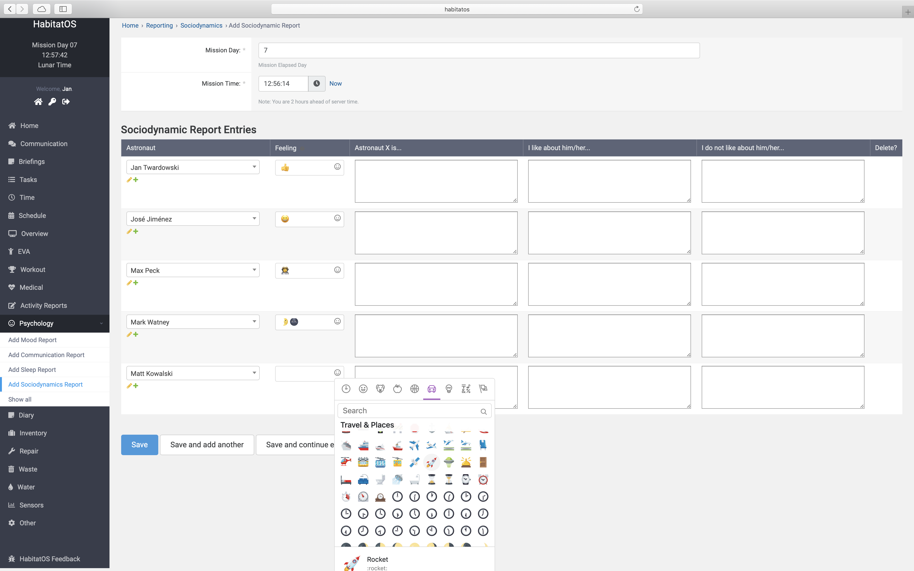
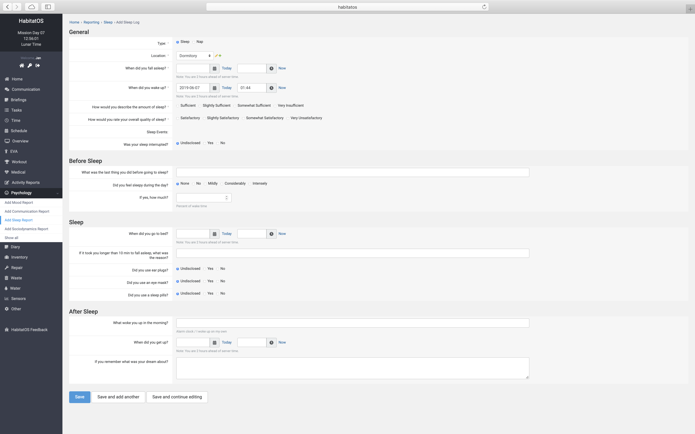
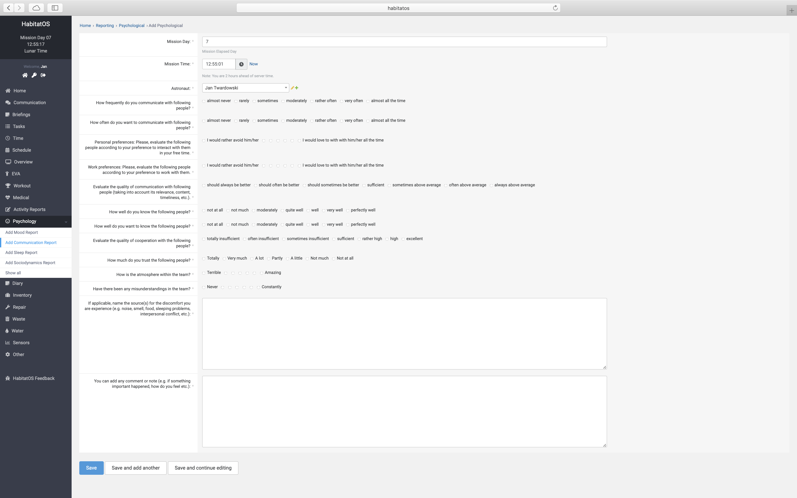
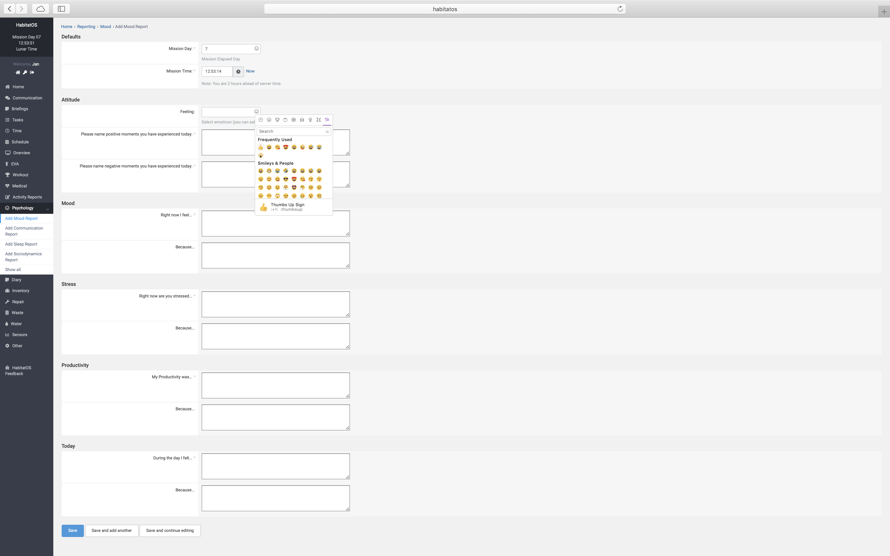
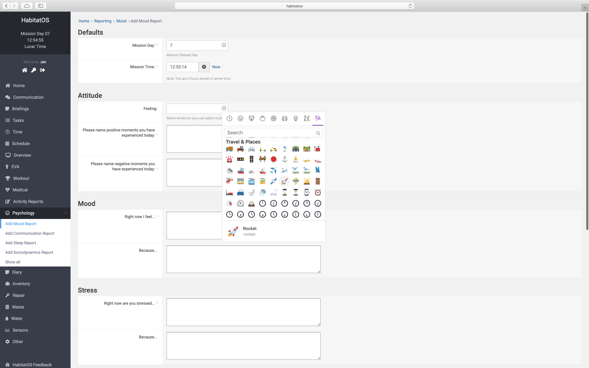

************************
Podsystem psychologiczny
************************

Do jednych z największych wartości naukowych uzyskiwanych z przeprowadzania analogowych misji kosmicznych należą badania dotyczące zachowania uczestników oraz dynamiki grupy. Badania takie przeprowadzane są nie tylko w habitatach, ale również w odległych miejscach tj. bazy naukowe na Arktyce i Antarktydzie. Dla przykładu zespoły pozostające w sezonie zimowym na kontynencie antarktycznym pozbawione są możliwości powrotu do cywilizacji nawet w przypadku poważnych problemów medycznych. Wielokrotnie zdarzało się, iż konieczne było przeprowadzanie inwazyjnych procedur medycznych i operacji przy wsparciu telemedycznym. Izolacja członków zespołu, stan zagrożenia oraz brak możliwości szybkiego powrotu do cywilizacji znacząco przyspieszają uwydatnianie się negatywnych cech osobowościowych. Dokładna obserwacja procesu powstawania oraz rozwijania się zaburzeń psychicznych pozwala na opracowanie metod budowania zespołu, podnoszenia morale oraz przezwyciężania syndromów, tj. depresji połowy pobytu czy syndromu trzeciej ćwiartki.

Jedną z głównych zalet holistycznego podejścia zbierania danych dotyczących uczestników symulacji jest możliwość badania wpływu poszczególnych czynności i parametrów wzajemnie na siebie. Np. przy bezproduktywnym dniu i pogorszeniu się relacji interpersonalnych poziom stresu może wzrosnąć a co może przełożyć się na gorszą jakość snu i dalsze pogłębienie konfliktu.

Dynamika zespołu
================
*HabitatOS* pozwala na wprowadzanie raportów personalnych oraz na zobrazowanie relacji interpersonalnych między członkami zespołu. System posiada formularz badań socjodynamicznych umożliwiający określenie cech osobowościowych jak również czynności, które działają negatywni oraz pozytywnie na relację osób między sobą. Po otrzymaniu sugestii od uczestników symulacji wprowadzono pole w formularzu pozwalające na wykorzystywanie emotikon obrazujących stan relacji. Podczas wielu symulacji okazało się, iż wykorzystanie emotikon jest skutecznym systemem pozyskiwania informacji na temat nacechowania stosunków. Każdej grafice przyporządkowany jest tekstowy stan nastroju, który ma odpowiednie nacechowanie.

Dane zebrane za pomocą formularza badania relacji i interakcji między członkami zespołu stanowią wrażliwą tajemnicę. System *HabitatOS* został zaprojektowany w sposób niepozwalający na wyświetlanie informacji dotyczącej opinii poszczególnych osób innym członkom zespołu. Do wprowadzonych danych dostęp ma jedynie osoba wprowadzająca dane oraz psycholog misji. Udostępnienie danych dotyczących relacji interpersonalnych może zaburzyć interakcję i dynamikę zespołu oraz wprowadzić konflikty.

:numref:`figure-system-psychology-sociodynamics` przedstawia ekran wprowadzania informacji dotyczącej relacji między członkami zespołu.

    Zrzut ekranu systemu *HabitatOS* pozwalający na uzupełnianie danych dotyczących relacji interpersonalnych. System został wyposażony w możliwość wybrania graficznej reprezentacji relacji w postaci emotikony.

Monitoring jakości snu
======================
Podczas pobytu w izolacji drastycznie spada jakość snu członków zespołu. Wpływ na to ma nie tylko plan dnia, ale również stres wywołany odmienną od codzienności rutyną i miejscem pobytu. *HabitatOS* został wyposażony w formularz wprowadzania informacji na temat snu, jego jakości oraz wpływu na efektywność pracy w trakcie dnia.

System *HabitatOS* umożliwia rejestrowanie snu oraz drzemek. Każde wydarzenie można dodatkowo opisać za pomocą aktywności wykonywanych przed jak i po śnie. Istnieje możliwość zaraportowania użycia dodatków, tj. użycie pigułek nasennych, korzystanie z maski na oczy czy zatyczek do uszu.

Dane wprowadzane przez uczestników symulacji są później analizowane przez psychologa misji. Na podstawie zestawienia z parametrami biomedycznymi, informacją na temat jakości snu oraz z wpływem parametrów środowiskowych podejmowana jest próba określenia wpływu na dynamikę grupy.

    Zrzut ekranu systemu *HabitatOS* przedstawiający formularz raportowania jakości snu.

Komunikacja interpersonalna
===========================
Komponent *Communication* podsystemu psychologicznego pozwala na zbieranie danych dotyczących relacji oraz komunikacji między członkami zespołu. Śledzenie interakcji oraz zmian dynamiki grupy jest jednym z głównych celów organizacji symulacji misji kosmicznych. Przedstawiony na :numref:`figure-system-psychology-communication` formularz pozwala na określenie parametrów jakościowych współpracy oraz przekazywania informacji między członkami zespołu. Zmiana tych parametrów w czasie świadczy o poprawie lub pogorszeniu relacji między uczestnikami symulacji.

    Zrzut ekranu systemu *HabitatOS* przedstawiający formularz komunikacji i współpracy między członkami zespołu.

Monitorowanie nastroju
======================
Monitorowanie nastroju członków załogi jest istotną sprawą wpływającą na efektywność zespołu oraz na pojawiające się w trakcie symulacji konflikty. Każda z osób inaczej reaguje na czynniki stresogenne tj. rutyna, jakość żywienia, stały niewielki zespół ludzi, izolacja, duże tempo pracy. W celu badania zmian nastroju wprowadzono formularz raportowania pozwalający na przekazanie psychologowi misji istotnych wrażeń i uczuć (:numref:`figure-system-psychology-mood-1`).

    Zrzut ekranu systemu *HabitatOS* przedstawiający formularz wyboru emotikon określających nacechowanie nastroju.

Podobnie jak w przypadku relacji interpersonalnych tak i w prywatnym formularzu nastroju na prośbę uczestników symulacji wprowadzono określanie nacechowania emocjonalnego za pomocą graficznej reprezentacji w postaci emotikon. Duża popularność tego rozwiązania jest skutkiem rozpowszechnionego wykorzystania tych grafik w codziennej komunikacji pisemnej za pomocą SMS-ów, wiadomości wysyłanych na portalach społecznościowych jak również wiadomości email. :numref:`figure-system-psychology-mood-1` oraz :numref:`figure-system-psychology-mood-2` przedstawiają zakres różnych emotikon umożliwiający zobrazowanie nastroju.

    Zrzut ekranu systemu *HabitatOS* przedstawiający formularz wyboru emotikon reprezentujący grafiki niebędące bezpośrednim określaniem nastroju w postaci tzw. "buźki", lecz wykorzystywane w celu przekazywania informacji, tj. informacja na temat podróży, oczekiwania czy znudzenia sytuacją.

