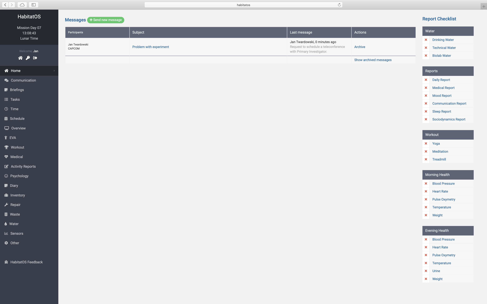
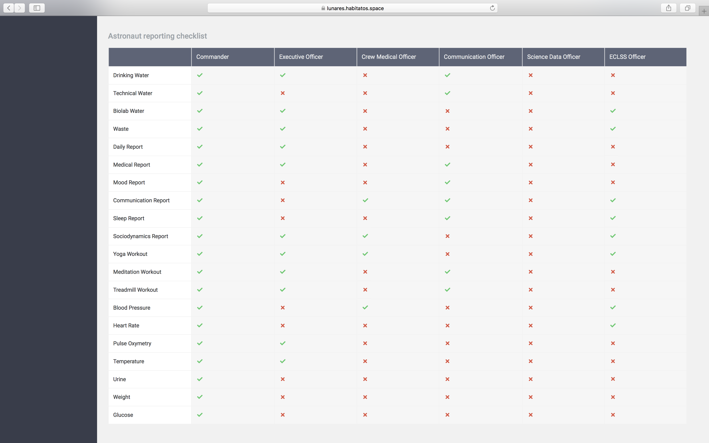
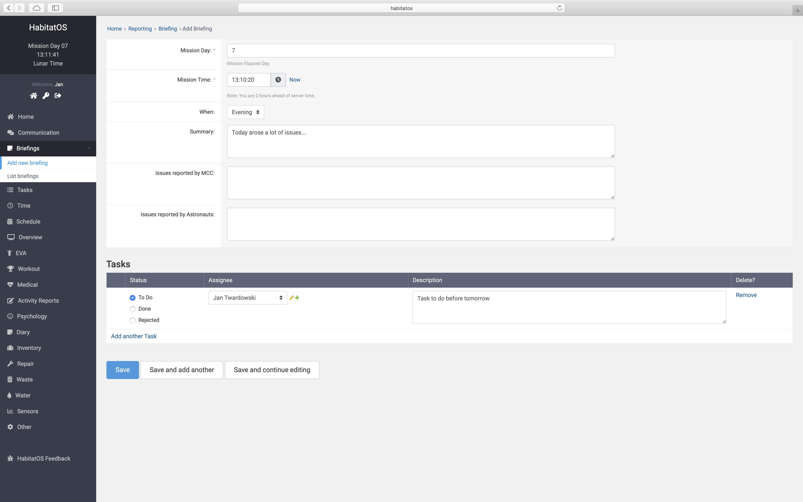
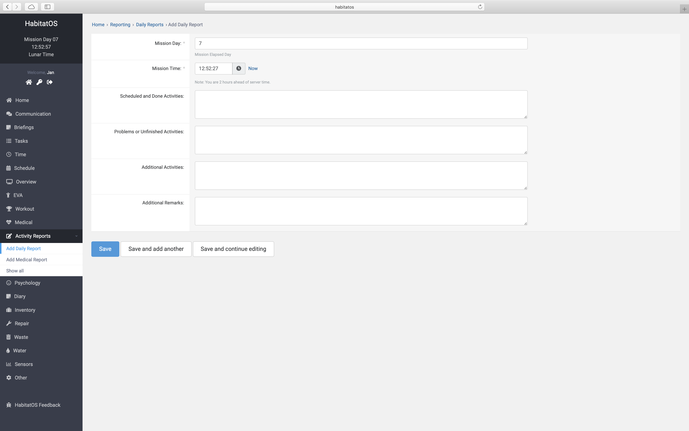
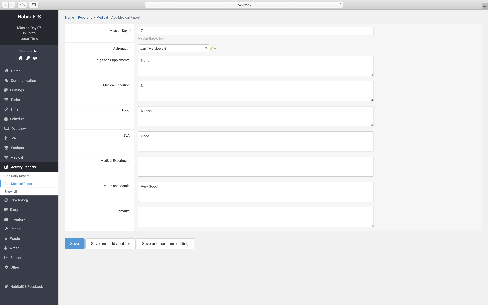
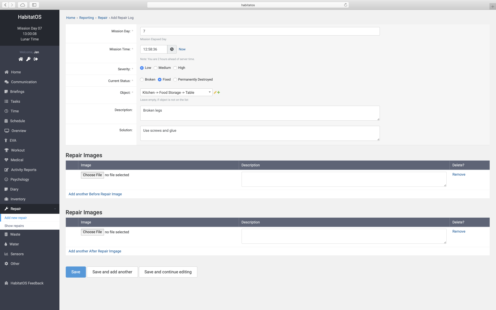

**********************
Podsystem raportowania
**********************

Głównym celem prowadzenia symulacji misji kosmicznych jest zebranie informacji na temat funkcjonowania habitatu, jego urządzeń, technologii oraz organizacji pracy operacyjnej. Niezbędnym elementem do zbierania wiedzy dotyczącej wyżej wymienionych kwestii jest moduł wsparcia raportowania.

Moduł raportowania zorganizowany jest wokół następujących kluczowych aspektów:

    - ``briefing`` - codziennie odprawy z przekazywanymi uwagami i wskazówkami,
    - ``maintenance`` - zbieranie informacji na bieżąco o awariach,
    - ``incidents`` - informacje dotyczące incydentów bezpieczeństwa,
    - ``task`` - podsumowania eksperymentów, badań naukowych lub po zakończeniu zadania,
    - ``daily`` - podsumowanie dzienne.

    Zrzut ekranu systemu *HabitatOS* przedstawiający widok dostępny dla astronautów. Pozwala na śledzenie postępu wykonania raportów. Lista zadań do wykonania dla danego dnia znajduje się po prawej stronie ekranu.

Ze względu na rozproszenie geograficzne, brak możliwości bezpośredniej komunikacji oraz dużą ilość osób biorących udział w symulacji zarówno po stronie MCC jak i zespole astronautów kluczową staje się możliwość przeglądu statusu wykonania raportów oraz podglądu stanu obecnego. :numref:`figure-system-report-dashboard-mcc` przedstawia podsumowujący widok dostępny dla kontrolera lotu, w którym widoczny jest status realizacji poszczególnych raportów dla każdego z astronautów. Po zalogowaniu członkowie załogi mogą śledzić postęp wykonania swoich raportów na :numref:`figure-system-report-dashboard-mcc`

    System *HabitatOS* pozwala kontrolerom lotu przeglądać status wykonania raportów każdego z astronautów.

Odprawy
=======
Każdego dnia symulacji centrum kontroli misji kontaktuje się z zespołem astronautów w celu przekazania wskazówek dotyczących wykonania zadań, przekazania informacji o zmieniających się okolicznościach lub zbliżającym się niebezpieczeństwie jak również w celu zebrania uwag astronautów np. dotyczących rozkładu zajęć danego dnia. Ustalenia podczas odpraw (ang. *briefing*) posiadają zamknięte w czasie przypisane imiennie zadania. Zadania posiadają status: "do zrobienia", "wykonane" oraz "odrzucone". :numref:`figure-system-report-briefing` przedstawia wygląd ekranu wspierającego przeprowadzanie odpraw.

    Zrzut ekranu systemu *HabitatOS* przedstawiający widok codziennych odpraw załogi i centrum kontroli misji. Do podsumowania ustaleń można załączyć imienne zadania. Zadania posiadają status: "do zrobienia", "wykonane" oraz "odrzucone".

Raporty dzienne
===============
Codzienne raporty podsumowujące dzień stanowią cenne źródło informacji na temat symulacji oraz pozwalają na wyciągnięcie wniosków dotyczących skuteczności operacyjnej. Astronauci w raportach umieszczają informacje dotyczące zrealizowanych zadań, nastawienia do wykonanej pracy oraz problemów jakie napotkali przy realizacji. :numref:`figure-system-report-daily` przedstawia ekran wprowadzania informacji dotyczących dziennego przebiegu i statusu pracy.

    Zrzut ekranu systemu *HabitatOS* przedstawiający ekran wprowadzania podsumowania dnia.

Cyklicznie astronauci muszą również raportować stan zdrowia oraz zażywane leki lub środki odurzające. Spożywanie alkoholu jest zabronione, lecz niektóre substancje chemiczne przyjmowane w charakterze leczniczym mogą wywoływać skutki uboczne przypominające upojenie alkoholowe i będące przeciwwskazaniem do operowania urządzeniami mechanicznymi jak również delikatną elektroniką w bazie kosmicznej. Podsumowanie medyczne dotyczy również informacji na temat stanu zdrowia, ekspozycji na substancje niebezpieczne zarówno w stanie ciekłym jak i gazowym jak również subiektywne wrażenia z działania organizmu. Do raportu w charakterze podsumowania załączane są badania medyczne wykonywane przy użyciu sprzętu w habitacie. Dane medyczne są bardzo wrażliwe, tzn. konieczne jest zapewnienie tajemnicy lekarskiej. Astronauci, aby podtrzymywać status "zdolny do lotu", tj. móc być przydzielanym do kolejnych misji, zatajają niektóre informacje medyczne. Celem systemu raportowania medycznego jest przekazanie informacji lekarzowi misji (ang. *Flight Surgeon*) o stanie zdrowia załogi pozwalającym na określenie czy nic nie zagraża bezpieczeństwu osób podczas symulacji :numref:`figure-system-report-medical` przedstawia ekran wprowadzania informacji medycznych oraz subiektywnego poczucia stanu astronauty.

    Zrzut ekranu systemu *HabitatOS* przedstawiający widok raportu medycznego astronauty.

Raport incydentów
=================
System *HabitatOS* pozwala na raportowanie incydentów. Przykładowym zdarzeniem tego typu może być zepsucie urządzenia, rozszczelnienie struktury poszycia habitatu lub nieprawidłowe działanie systemu. Astronauci mają możliwość stworzenia wydarzenia w systemie, które umożliwia śledzenie wykonywania napraw oraz przywracania obiektu do działania. Każde wydarzenie może zawierać zdjęcia uszkodzeń wraz ze skalą w postaci miarki, która pozwala na określenie wielkości zniszczeń. Następnie użytkownicy systemu mogą raportować progres wykonywania naprawy dokumentując jej kolejne kroki. Na końcu po dokonaniu modyfikacji i przywróceniu sprawności można zmienić status obiektu i przywrócić go do normalnego procesu użytkowania.

Naprawa zrealizowana i udokumentowana w sposób precyzyjny pozwala na śledzenie awaryjności urządzeń oraz przewidywanie konieczności wymiany, jak również odkrycie wad fabrycznych. Może to skutkować usunięciem urządzenia z habitatu oraz konieczność zmiany dostawcy.

    Zrzut ekranu systemu *HabitatOS* przedstawiający ekran wprowadzania informacji dotyczącej naprawy elementu wyposażenia habitatu.

Incydenty bezpieczeństwa
========================
W systemie zaraportowany może zostać również incydent bezpieczeństwa. Jest to działanie, które mogło spowodować narażenie zespołu na niebezpieczeństwo. Ze względu na wrażliwość treści takie incydenty zgłaszane są do :term:`MCC`, a ich widoczność ograniczona jest wyłącznie do zgłaszającego oraz rozwiązującego sprawę. :numref:`figure-system-report-repair` przedstawia widok wprowadzania informacji dotyczących napraw sprzętu w habitacie.

Incydenty bezpieczeństwa pozwalają na zapis procedury postępowania awaryjnego jak również ścieżki odtworzenia problemu. W przypadku, gdyby doszło do uszczerbku na zdrowiu załogi są również źródłem śledzenia postępu sprawy.
