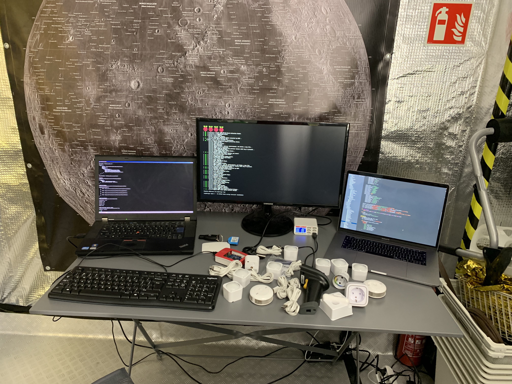
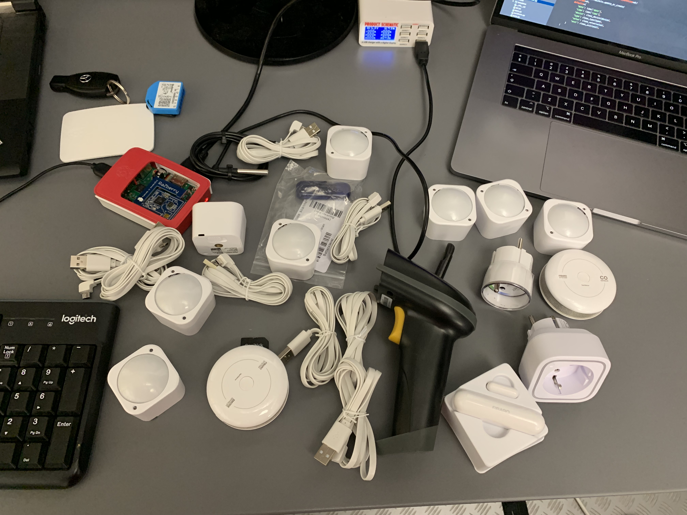
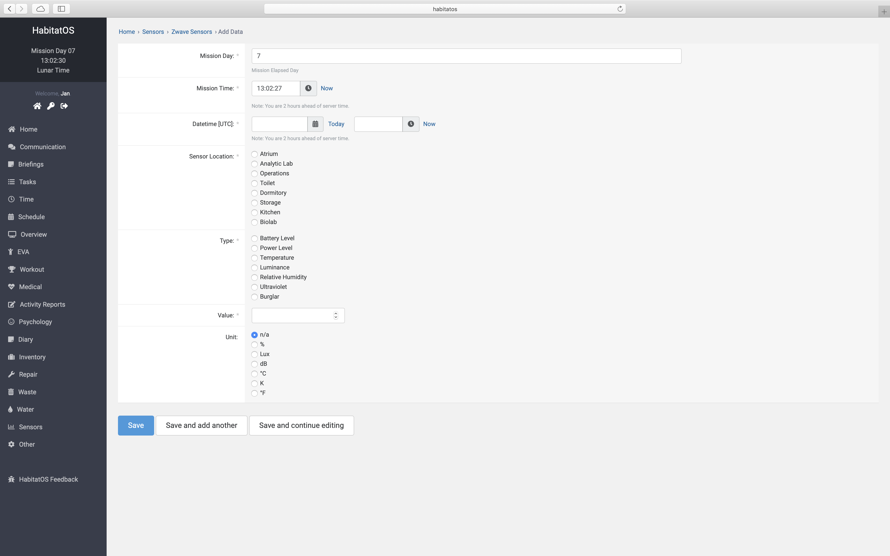
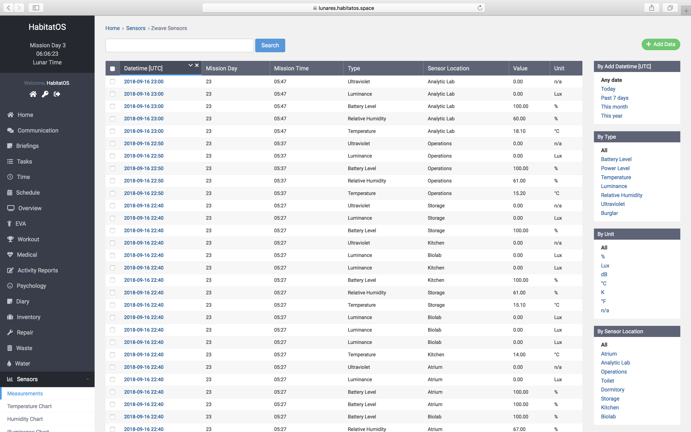
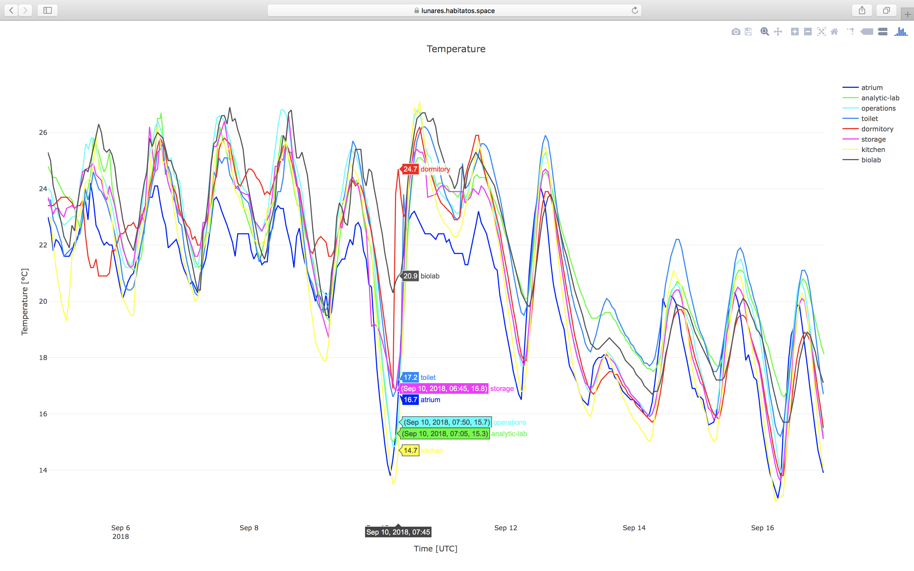

******************
Podsystem sensorów
******************

System *HabitatOS* pozwala na wizualizację zbieranych danych z sensorów rozmieszczonych w habitacie oraz poza jego obszarem. Monitorowanie parametrów środowiskowych oraz atmosferycznych jest jednym z kluczowych aspektów działania :term:`systemu podtrzymywania życia <ECLSS>`.

System pozwala na wyświetlanie stanu aktualnego, przechowywanie informacji historycznych oraz wyszukiwanie i filtrowanie po zadanym parametrze. Przy wykorzystaniu wbudowanych mechanizmów możliwe jest prześledzenie zmian parametrów środowiskowych oraz określenie ich wpływu na załogę.

Urządzenia pomiarowe i sensory
==============================
Dane do systemu operacyjnego przekazywane są przez zestaw sensorów zarówno skonstruowanych przez twórców habitatu jak również gotowych urządzeń dostępnych komercyjnie. :numref:`figure-system-sensor-devices-2` przedstawia poglądowy widok wykorzystywanych sensorów. Oprogramowanie sterujące urządzeniami zostało napisane przez autora systemu (:numref:`figure-system-sensor-devices-1`).

    Zdjęcie stanowiska konfiguracji urządzeń i sensorów wraz z widocznym procesem kompilacji kodu źródłowego sterowników.

Wśród urządzeń dostępnych komercyjnie wymienić można m.in. sensory firm Aeotec oraz Fibaro. Należą do nich:

    - kontrolery otwarcia drzwi,
    - czujniki temperatury, UV, ruchu, wilgotności względnej,
    - czujniki CO oraz dymu,
    - mierniki napięcia sieciowego.

Własnoręcznie zbudowane urządzenia znajdują głównie zastosowanie w hydroponice i pozwalają na kontrolę urządzeń elektronicznych, pomiar temperatury oraz parametrów medium, rezystancji cieczy jak również poziomu wody, kontroli przepływu i załączania pomp.

    Zdjęcie przedstawia wybrane sensory wykorzystane przy konstrukcji habitatu. Zdjęcie wykonano w trakcie konfiguracji urządzeń do pracy z systemem HabitatOS.

Akwizycja danych
================
Dane zbierane są przez sensory i przesyłane bezprzewodowo za pomocą protokołu Z-Wave. Protokół ten jest standardem łączności wykorzystywanej przez urządzenia tzw. Internetu urządzeń (ang. *Internet of Things*, *IoT*). Kontroler (stacja bazowa) nasłuchuje rozgłoszeń i zapisuje informacje wraz z datą przyjścia pakietu danych, pomierzoną wartością, jednostką fizyczną pomiaru, identyfikatorem urządzenia i pozycją rozlokowania urządzania w habitacie.

W *HabitatOS* istnieje również możliwość ręcznego wprowadzania danych środowiskowych, np. na wypadek uszkodzenia któregoś z sensorów jak również w przypadku dokonywania niestandardowych pomiarów. :numref:`figure-system-sensor-data-add` przedstawia ekran ręcznego wprowadzania danych pomiarowych do systemu.

    Zrzut ekranu systemu *HabitatOS* przedstawiający ekran ręcznego wprowadzania danych z pomiarów środowiskowych.

Wspierane wielkości fizyczne
============================
*HabitatOS* wspiera wprowadzanie następujących wartości i pomiarów fizycznych:

    - ciśnienie parcjalne tlenu,
    - stężenie dwutlenku węgla,
    - stężenie tlenku węgla (czadu),
    - poziom natężenia światła,
    - obecność dymu,
    - wilgotność względną,
    - obecność ruchu (fotokomórki),
    - prędkość transmisji danych,
    - ciśnienie atmosferyczne,
    - poziom promieniowania,
    - temperatura,
    - poziom ekspozycji UV,
    - wibracje (czujnik ruchu),
    - napięcie prądu,
    - natężenie prądu,
    - zjawiska atmosferyczne,
    - prędkość wiatru,
    - poziom zanieczyszczenia atmosfery (pył),
    - zasięg widzialności.

:numref:`figure-system-sensor-data` przedstawia listę pomiarów zebranych w systemie wraz z możliwością filtrowania względem urządzenia pomiarowego, jednostki pomiaru, lokacji sensora oraz czasu uzyskania danych.

    Zrzut ekranu systemu *HabitatOS* przedstawia listę pomiarów zebranych w systemie wraz z możliwością filtrowania względem urządzenia pomiarowego, jednostki pomiaru, lokacji sensora oraz czasu uzyskania danych.

Synchronizacja
==============
Wszystkie parametry środowiskowe zebrane z sensorów umieszczane są w lokalnej bazie danych sterownika. Zabieg ten ma na celu przechowywanie lokalnej kopii danych na wypadek utraty połączenia z systemem. Do danych umieszczana jest również informacja o synchronizacji z systemem *HabitatOS*. Próba wepchnięcia danych odbywa się co trzy minuty. Dzięki zastosowaniu podtrzymywania bateryjnego na wypadek awarii prądu możliwe jest zbieranie informacji nawet w przypadku niedostępności innych systemów. Zaległe dane wypychane są do *HabitatOS*, gdy tylko połączenie z systemem zostanie ponownie nawiązywane.

*HabitatOS* obsługuje wykrywanie duplikatów danych i nie pozwala na ponowne wprowadzenie informacji i pomiarów, które już znajdują się w jego bazie.

Wizualizacja danych
===================
Podsystem sensorów oraz wizualizacji parametrów środowiskowych habitatu stanowi jeden z krytycznych obszarów systemu. Informacje zbierane w obrębie tego modułu są składowane w bazie danych (:numref:`figure-system-sensor-data`) oraz przedstawiane w czasie rzeczywistym członkom załogi jak również wraz ze stosownym opóźnieniem kontrolerom :term:`MCC`. :numref:`figure-system-sensor-dashboard` przedstawia ekran systemu z wyświetlonym rzutem izometrycznym habitatu oraz z nałożonymi danymi pobranymi w wybranych miejscach habitatu.

.. figure:: img/sensor-dashboard.png
    :name: figure-system-sensor-dashboard

    Zrzut ekranu systemu *HabitatOS* przedstawia wizualizację habitatu w rzucie izometrycznym wraz z nałożonymi danymi pobranymi w wybranych miejscach budynku.

Wizualizacja trendów i danych historycznych
===========================================
Kluczowymi parametrami wpływającymi na samopoczucie załogi jest temperatura, wilgotność względna oraz ciśnienie atmosferyczne i natężenie światła w habitacie. Dane poza wyświetlaniem z chwili aktualnej mają możliwość być wizualizowane z wykorzystaniem tzw. szeregów czasowych i linii trendów (:numref:`figure-system-sensor-chart`).

Wykresy mogą przedstawiać każdy zmierzony parametr. Istnieje możliwość przybliżania i oddalania wykresu w celu wizualizacji trendów dobowych oraz długoterminowych. Po uzyskaniu zadanego okresu istnieje możliwość eksportu danych do różnych formatów graficznych.

    Zrzut ekranu systemu *HabitatOS* przedstawiający wizualizację linii trendu temperatury w habitacie. W prawym rogu istnieje możliwość filtrowania względem wybranego urządzenia. W prawym górnym rogu znajdują się opcje skalowania, wycinania zakresu jak również możliwość eksportu wykresu.
