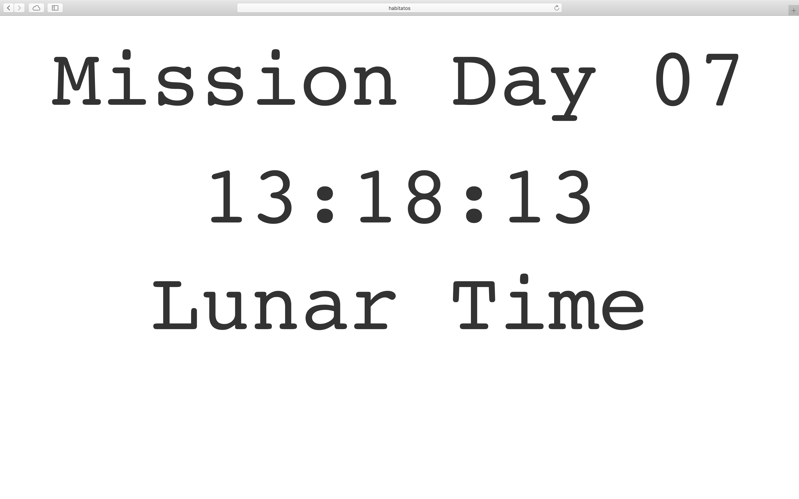

***************
Podsystem czasu
***************

System *HabitatOS* pozwala na pracę w wielu strefach czasowych zarówno na Ziemi jak i na innych ciałach niebieskich. W systemie możliwa jest praca z datami i czasem zapisanym w następujących formatach:

    - czas UTC na Ziemi,
    - dowolna strefa czasowa na Ziemi,
    - czas misji,
    - dowolna strefa czasowa na Księżycu,
    - dowolna strefa czasowa na Marsie.

System dokonuje konwersji czasów i dat pozwalając na pracę w naturalnym dla użytkownika czasie lokalnym. Dla przykładu zespoły pracujące podczas symulacji misji marsjańskich mogą posługiwać się datami rozpoczęcia i zakończenia wydarzeń w harmonogramie dnia wyrażając ten moment w dogodnej dla siebie strefie czasowej na Marsie.

Ponadto w wyniku znacznych odległości oraz skończonej prędkości fali elektromagnetycznej notowane są opóźnienia w komunikacji (:term:`One-Way Light Time`) wynoszące odpowiednio:

    - Księżyc - około 1,28 sekundy,
    - Mars - od około 3-21 minut.

Należy również uwzględnić:

    - różną długość doby i miesiąca księżycowego,
    - różną długość doby (:term:`Sol`), tygodnia, roku marsjańskiego.

Strefy czasowe i konwersja czasu
================================

Czas ziemski
------------
Na Ziemi czas najczęściej podaje się w wartości lokalnej. Mnogość stref czasowych i problemy z konwersją między nimi wynikające z uwarunkowań politycznych oraz uwzględnienia :term:`czasu zimowego i letniego <Daylight Saving Time>` (ang. *Daylight Saving Time*, *DST*) spowodowały, iż np. w przemyśle lotniczym oraz kosmicznym jedynym wykorzystywanym formatem jest data podawana w :term:`czasie uniwersalnym koordynowanym <Universal Time Coordinated>` (ang. *Universal Time Coordinated*, *UTC*).

Wszystkie informacje na temat momentów i dat zapisywane są w bazie danych w strefie UTC, a konwersja następuje podczas wyświetlania i zapisywania danych. Przechowywanie czasu w uniwersalnym standardzie zapobiega występowaniu kolizji zadań i pomyłek przy specyfikacji terminów :cite:`VideoComputerphileTimeZones`.

Czas misji
----------
W przemyśle kosmicznym stosuje się również tzw. :term:`czas misji <Mission Elapsed Time>` (ang. *Mission Elapsed Time*, *MET*) wyrażający ilość sekund (zgodnych z układem SI) od momentu rozpoczęcia misji.

Uczestnicy misji mają do dyspozycji ekran przedstawiający aktualny czas misji (:numref:`figure-system-time-dashboard`).

    Zrzut ekranu systemu *HabitatOS* przedstawiający ekran aktualnego czasu misji.

Czas księżycowy
---------------
W celu prowadzenia misji księżycowych, dezorientacji członków biorących udział w symulacji zdecydowano się na wprowadzenie czasu Lunar Standard Time. Czas księżycowy zaproponowany przez Rudolph N.J. Draaisma oraz organizację LunarClock.org :cite:`Draaisma2007`. Format ten jest intuicyjny i w prosty sposób pozwala na rozpoczęcie badań. Uczestnicy szybko przestawiają się na harmonogram dnia wykorzystujący ten czas. Zegarki i urządzenia odmierzające czas (np. w komputerze) szybko się rozsynchronizują, a uczestnicy są zmuszeni do korzystania z *HabitatOS* jako wyznacznika czasu.

Jako początek liczenia czasu przyjmuje się datę 1969-07-21T02:56:15Z tj. moment postawienia pierwszego kroku przez astronautę Neila Armstronga na powierzchni Księżyca. Czas księżycowy składa się z 12 dni księżycowych. Każdy z dni nazwany jest nazwiskiem jednego z 12 astronautów programu Apollo, którzy stąpali po jego powierzchni (:numref:`table-system-time-lst`).

.. csv-table:: Rok księżycowy wg. formatu Lunar Standard Time
    :name: table-system-time-lst
    :header: "Dzień", "Nazwa miesiąca", "Ilość cykli"

    "1", "Armstrong", "1-30"
    "2", "Aldrin", "1-30"
    "3", "Conrad", "1-30"
    "4", "Bean", "1-30"
    "5", "Shepard", "1-30"
    "6", "Mitchell", "1-30"
    "7", "Scott", "1-30"
    "8", "Irwin", "1-30"
    "9", "Young", "1-30"
    "10", "Duke", "1-30"
    "11", "Cernan", "1-30"
    "12", "Schmitt", "1-30"

Każdy z dni podzielony jest na 30 równych cykli, podzielonych na 24 księżycowych godzin, 60 księżycowych minut oraz 60 księżycowych sekund. Format zapisu daty wygląda następująco:

    52-08-22 ∇ 19:53:16

Rozumieć należy go jako:

    - 52 lata księżycowe od pierwszego kroku Neila Armstronga,
    - 8 dzień księżycowy (Irwin),
    - 22 cykl ósmego dnia,
    - ∇ - separator daty i czasu,
    - 19:53:16 - czas księżycowy: godzina, minuta i sekunda.

Według formatu LST dzień księżycowy podzielony jest na 15-sto dobowy okres dnia oraz 15-sto dobowy okres nocy. Doba na księżycu wg. LST odpowiada zatem około 29,5 dnia ziemskiego (od 29,27 do 29,83). Średnia długość ze względu na precesję oraz perturbacje orbit również nie jest stała i wynosi około 29,530589 dnia ziemskiego. W proponowanej przez format LST konwencji, aby ułatwić podawanie czasu długość sekundy księżycowej ustalona jest na wartość 0,9843529666671, będącej wynikiem dzielenia 29,530589/30.

W świecie stałych fizycznych (oraz w układzie SI) długość trwania sekundy jest jasno określona i nie może być zmieniona. LST jest jedynie konwencją, która była wykorzystana podczas symulacji księżycowej LunEx-1 w sierpniu 2017 roku. Głównym założeniem misji był eksperyment z rytmem dobowym astronautów i możliwe było wykorzystanie innego czas w celu dezorientacji i desynchronizacji z czasem ziemskim.

Czas marsjański
---------------
W systemie *HabitatOS* zaimplementowano konwersję czasu między wydarzeniami na Ziemi oraz na Marsie zgodnie z algorytmem zaproponowanym w publikacji NASA :cite:`Allison2000`. Doby marsjańskie (Sole) są dłuższe od Ziemskich. Ich długość wynosi 88642,663 sekundy (24 h 37 min 22.663 s) czasu gwiazdowego oraz 88775,244147 czasu słonecznego (24 h 39 m 35,244 s). Wartości te dla Ziemi wynoszą odpowiednio: 23 h 56 m 4,0916 s oraz 24 h 00 m 00,002 s. Współczynnik konwersji wynosi 1,027491252 dnia/sol, co daje około 2,7% dłuższą dobę marsjańską (:term:`sol`) od ziemskiej :cite:`Allison2000`, :cite:`Allison1997`.

Podobnie jak marsjańska doba, inną długość mają marsjańskie tygodnie, miesiące i rok. Na Marsie analogicznie do Ziemi istnieje wiele stref czasowych przesuniętych o offset godzinowy od głównej strefy zwanej :term:`koordynowanym czasem marsjańskim <Coordinated Mars Time>` (ang. *Coordinated Mars Time*, *MTC*), która jest odpowiednikiem ziemskiego :term:`UTC`. Offset wynika z różnicy długości geograficznej miejsc oraz prędkości obrotowej planety. W zależności od lokacji symulowanej bazy marsjańskiej do wyliczenia odpowiedniego momentu czasu konieczne jest uwzględnienie wspomnianego offsetu.

W astronomii do obliczania dat używa się kalendarza Juliańskiego (rok równy 31557600 sekund, tj. 365,25 dnia). Marsjańskim odpowiednikiem daty Juliańskiej jest :term:`Mars Sol Date (MSD) <Mars Sol Date>`. Rok marsjański wynosi 668,5921 soli. W celu obliczenia MSD wykorzystano algorytm zaproponowany przez M. Allison oraz M. McEwen :cite:`Allison2000`. Różnicę czasu wylicza się ze wzoru:

    :math:`MSD = ([(Δt_{J2000} − 4,5) / 1,027491252] + 44796,0 − 0,0009626)`

gdzie:

    * :math:`Δt_{J2000}` czas w dniach, który upłynął od epoki J2000 (2000-01-01T11:58:55.816Z czasu UTC),
    * :math:`Δt_{J2000} − 4,5` - przesunięcie między północą J2000 a północą :term:`UTC`,
    * 1,027491252 - współczynnik konwersji dnia ziemskiego na :term:`sol` (marsjański dzień jest tyle razy dłuższy),
    * 44796,0 - przez konwencję do daty dodaje się tę wartość, aby uniknąć wartości ujemnych,
    * 0,00096 - poprawka uwzględniająca przesunięcie północy marsjańskiej i ziemskiej :math:`Δt_{J2000}`.

W zaproponowanym algorytmie :cite:`Allison2000` użyto poprawki synchronizacji północy wynoszącej −0,00072. Później Dr. Robert B. Schmunk, pracownik NASA tworzący zegar Mars24 wykorzystywany przez tę agencję precyzyjniej oszacował tę wartość i ustalił poprawkę na 0,0009626. Również wartość współczynnika konwersji zwiększyła precyzję do 1,0274912517.

Jako punkt synchronizacji przyjmuje się północ 6 stycznia 2000 ziemskiego czasu UTC (2000-01-06T00:00:00Z). W tym momencie północ na marsie na głównym południku różniła się o 21 sekund. Data 2000-01-06T00:00:00Z w kalendarzu Juliańskim J2000 różniła się o 4,5. Z tego powodu :math:`Δt_{J2000} − 4,5` jest przyjmowany jako punkt synchronizacyjny.

Opóźnienia komunikacji
======================
W wyniku znacznych odległości oraz skończonej prędkości fali elektromagnetycznej notowane są opóźnienia w komunikacji. Czas opóźnień określa się z użyciem następującej nomenklatury:

    - :term:`opóźnienie w jedną stronę <One-Way Light Time>` (ang. *One-Way Light Time*, *OWLT*),
    - :term:`opóźnienie komunikacji w dwie strony <Two-Way Light Time>` (ang. *Two-Way Light Time*, *TWLT*) lub :term:`Round Trip Time`,
    - :term:`czas wydarzenia zegara pokładowego <Spacecraft Event Time>` (ang. *Spacecraft Event Time*, *SCET*),
    - :term:`czas notowania wydarzenia na Ziemi <Earth Received Time>` (ang. *Earth Received Time*, *ERT*).

Opóźnienie jest realizowane w systemie *HabitatOS* jedynie pomiędzy osobami, wobec lokacji których istnieje znaczna odległość dla prędkości rozchodzenia się fali elektromagnetycznej. Opóźnienie czasowe ma istotny wpływ na komunikację wewnątrz zespołu.

Dla przykładu przy komunikacji między członkami :term:`MCC` zgrupowanymi w obrębie jednego budynku opóźnienie nie występuje. Podobnie pomiędzy astronautami w jednym habitacie lub na niewielkim ciele niebieskim tj. Księżyc czy Mars. W przypadku komunikacji między :term:`MCC` na Ziemi oraz astronautami w habitacie na Marsie odległość powoduje wystąpienia opóźnień 3-21 minut w zależności od aktualnego ustawienia planet względem siebie.

*HabitatOS* jest przystosowany do prowadzenia misji równolegle w wielu habitatach, tj. zarówno na Księżycu jak i Marsie. Odmienne opóźnienie będzie dotyczyło komunikacji:

    - MCC - habitat na Marsie,
    - MCC - habitat na Księżycu,
    - habitat na Marsie - habitat na Księżycu,
    - komunikacja między członkami MCC (w jednej lokalizacji geograficznej),
    - habitat na Marsie z innym habitatem na Marsie (znacznie oddalonym),
    - habitat na Księżycu z innym habitatem na Księżycu (znacznie oddalonym).

W obliczeniach przyjmowane są wartości układu SI prędkości światła w próżni równe 299 792 458 m/s.

W wyniku precesji oraz perturbacji orbit wartości apsyd, tj.: perycentrum (peryapsis), oraz apocentrum (apoapsis) mogą przyjmować różne wartości w czasie. Do obliczeń wykorzystywana jest średnia wartość tych parametrów.

Opóźnienie w misjach księżycowych
---------------------------------
Do określenia średniego opóźnienia czasu wykorzystano pomiary odległości Ziemi od Księżyca z milimetrową precyzją. Możliwe było to dzięki wykorzystaniu eksperymentu *Lunar Laser Ranging experiment* wykorzystującemu zainstalowane przez astronautów programu Apollo urządzenie *Lunar Ranging Retro Reflector* (LRRR) składające się z nachylonych odpowiednio luster. Uzyskane dane zbierano przez okres 20 lat :cite:`Battat2009`

.. csv-table:: Odległości Ziemi od Księżyca
    :name: table-system-time-delay-moon
    :header: "Parametr", "Wartość minimalna [km]", "Wartość minimalna [km]", "Wartość średnia [km]"

    "Peryapsis", "356 400", "370 400", "362 600"
    "Apoapsis", "404 000", "406 700", "405 400"

* Średni dystans księżyca:  384,402 km :cite:`Battat2009`,
* Średnie opóźnienie: 1,28 sekundy.

Opóźnienie w misjach marsjańskich
---------------------------------
Opóźnienie czasowe wynikające z odległości Marsa od Ziemi jest uzależnione od położenia dwóch planet względem siebie. Poniższe wartości apsyd podano po uwzględnieniu precesji oraz perturbacji orbit. Najmniejsza wartość opóźnienia pojawia się przy najbliższym zbliżeniu obu planet odbywającym się co 26 miesięcy.

.. csv-table:: Odległości Ziemi od Marsa
    :name: table-system-time-delay-mars
    :header: "Parametr", "Odległość [m]", "Opóźnienie [s]", "Opóźnienie [min]"

    "Peryapsis (teoretycznie)", "54 562 227 356 (54 mln km)", "182", "3,03"
    "Peryapsis (zanotowana)", "56 061 189 646 (56 mln km)", "187", "3,11"
    "Apoapsis", "402 321 478 636 (402 mln km)", "1,342", "22,4"
    "Średnia", "225 144 135 958 (225 mln km)", "751", "12,5"

* Średni dystans Marsa: 225 mln km,
* Średnie opóźnienie 751 sekund (12,5 minuty).
