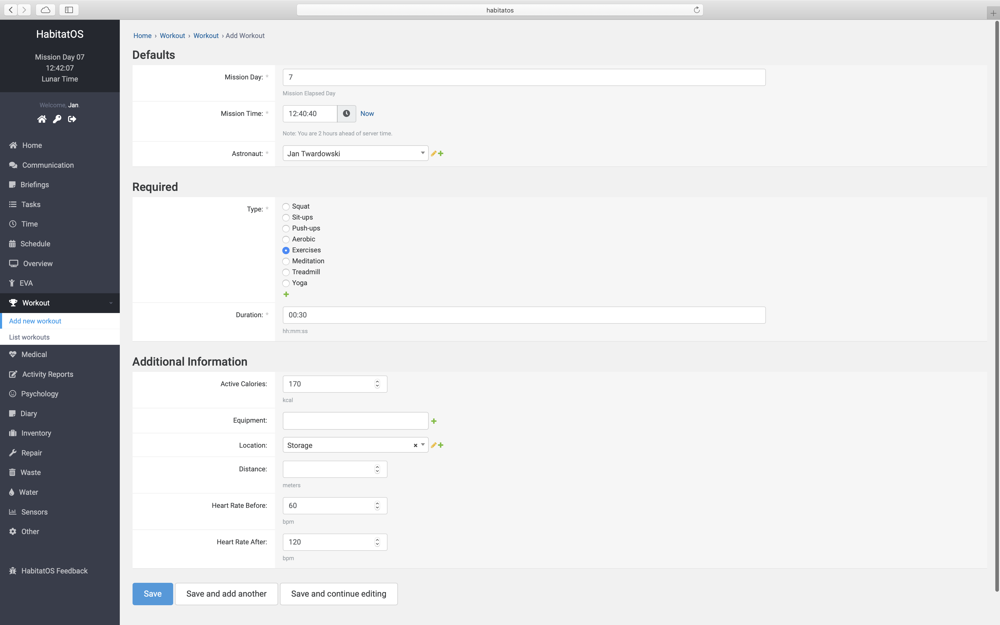

*****************************
Aktywność fizyczna i sportowa
*****************************

Podsystem śledzenia aktywności fizycznej jest niewielkim modułem pozwalającym na mierzenie postępu wykonywania ćwiczeń zabezpieczających astronautów przed utratą masy mięśniowej oraz tkanki kostnej wskutek demineralizacji.

Do obowiązków każdego z uczestników symulacji misji kosmicznej należy dbanie o sprawność fizyczną. W tym celu dziennie zaplanowana jest jedna godzina aktywności sportowej. Wykonywane ćwiczenia zależą od astronauty, gdyż na chwilę obecną indywidualny plan treningowy jest w fazie opracowywania.

    Zrzut ekranu systemu *HabitatOS* przedstawiający formularz wpisywania informacji dotyczącej wykonanej aktywności fizycznej.

Dyscypliny sportu
=================
System umożliwia samodzielne definiowanie różnych dyscyplin sportu. Domyślnymi opcjami do wyboru są:

    - przykucnięcia,
    - przysiady,
    - pompki,
    - aerobik,
    - ćwiczenia gimnastyczne,
    - medytacja,
    - bieżnia,
    - joga.

Na chwilę obecną system nie posiada możliwości wpisywania podzielonego treningu, tj. składającego się z kilku aktywności fizycznych. Obecnie w tym celu konieczne jest wprowadzenie wielokrotnych wydarzeń sportowych, których wyniki zostaną ujęte w zestawieniu dziennym. W trakcie opracowywania jest formularz umożliwiający na tzw. treningi łączone jak również interwałowe.

Śledzenie aktywności fizycznej
==============================
Wymaganymi informacjami do uzupełnienia po wykonaniu aktywności sportowej jest określenie czasu trwania oraz wybranie rodzaju aktywności tj. dyscypliny.

Dodatkowymi informacjami są:

    - kalorie spalone podczas treningu,
    - ekwipunek wykorzystywany podczas treningu,
    - lokacja wykonywania ćwiczeń,
    - dystans przebyty (dotyczy biegów na bieżni, jazdy na rowerze itp.),
    - puls przed ćwiczeniami,
    - puls po ćwiczeniach.

W trakcie tworzenia jest integracja z usługami producentów urządzeń ubieranych (ang. *wearable*). Dzięki scaleniu systemów możliwe będzie śledzenie postępów wykonywania ćwiczeń, zapisu aktywności biomedycznej podczas treningu oraz dostęp do informacji zbieranych podczas codziennej aktywności niezwiązanej z ćwiczeniami sportowymi, tj. ilość kroków, aktywność, czas stania i ilość kalorii spalonych w ciągu dnia.
